1、添加设备组
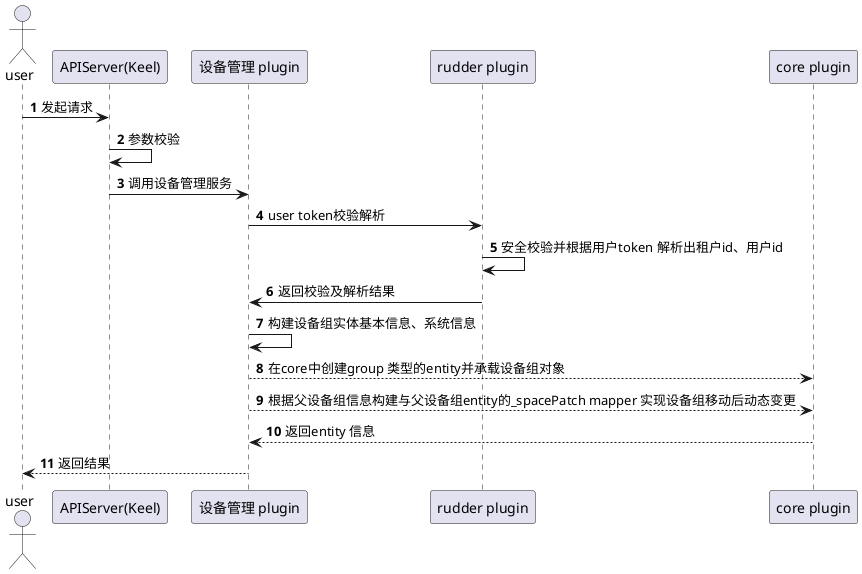
1.1 设备组对象图

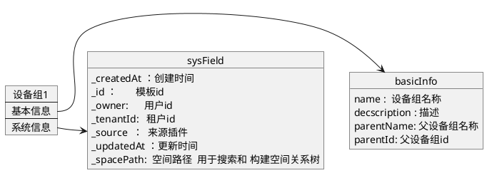

2、 编辑设备组

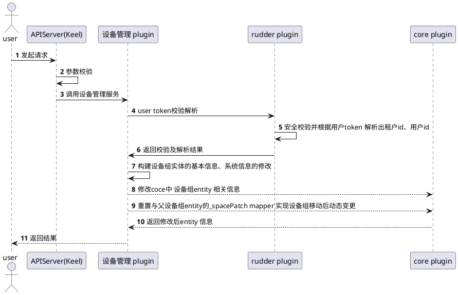

3、删除设备组
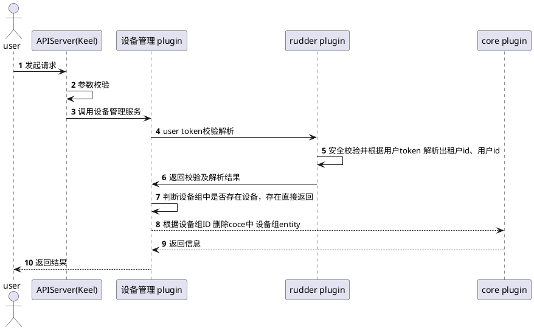

4、获取设备组空间关系树
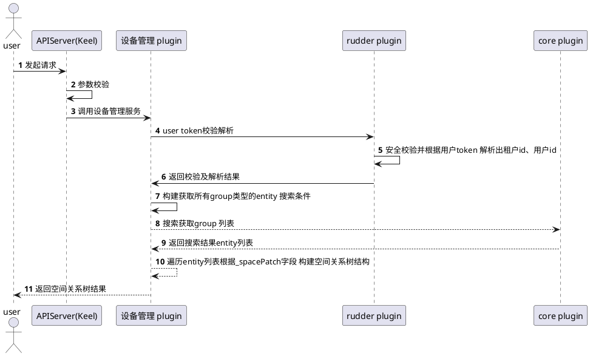
5、 添加设备
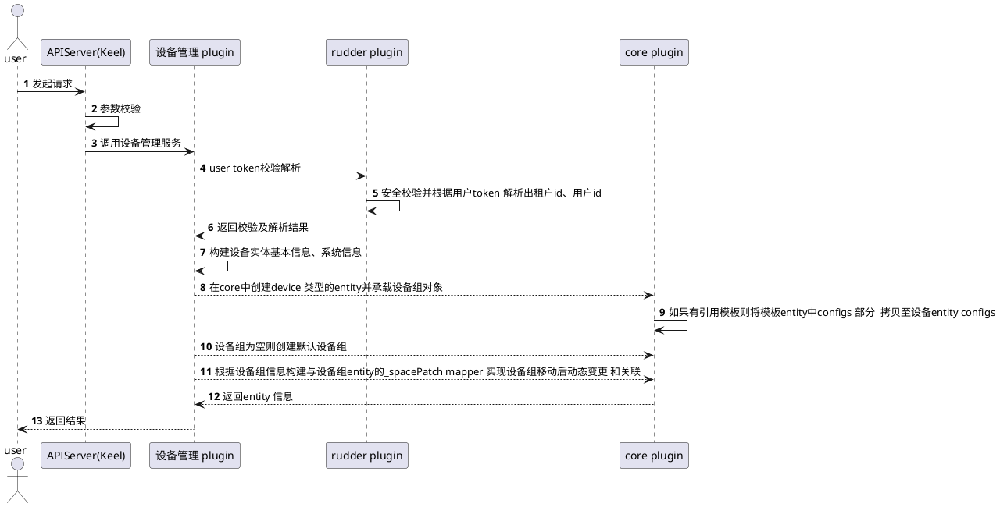
1.1 设备对象图

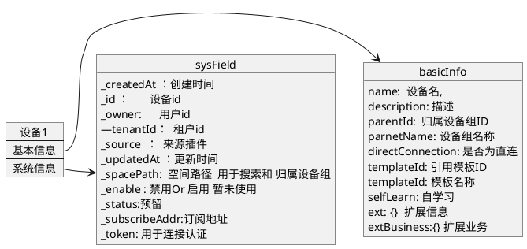

6、删除设备
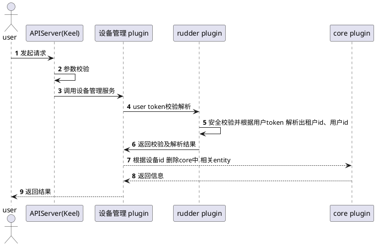

7、修改设备信息
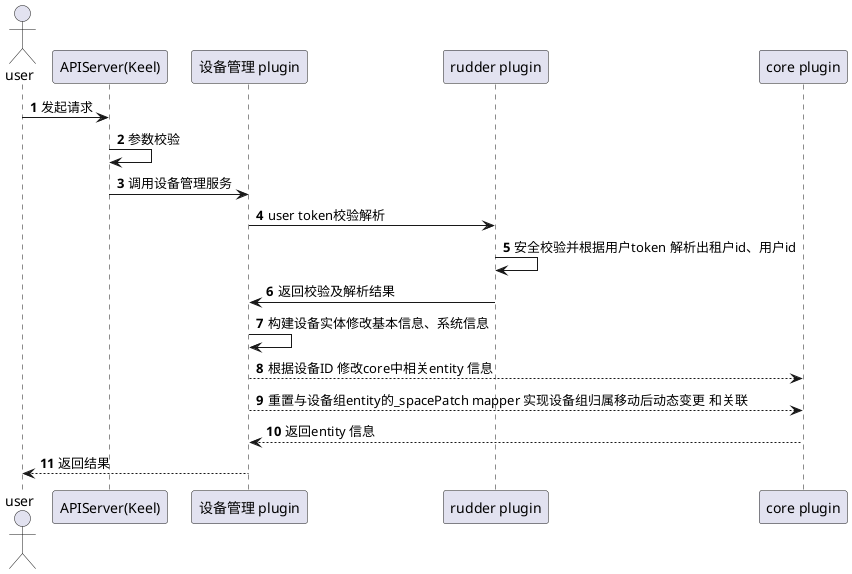

8、获取设备列表
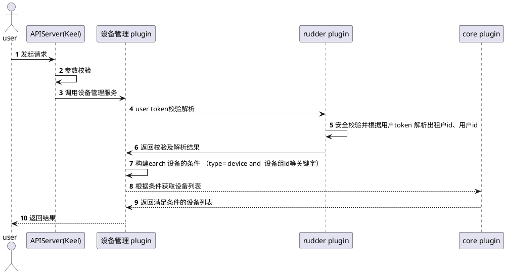

9、获取设备所有详情
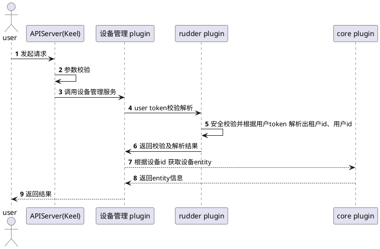

9.1 设备详情对象图

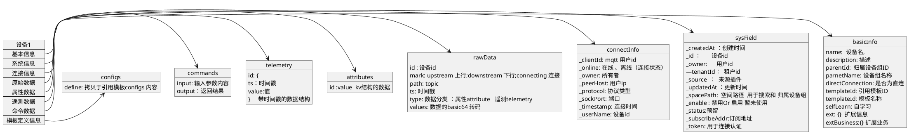

10、获取设备基本信息

11、 获取设备系统信息
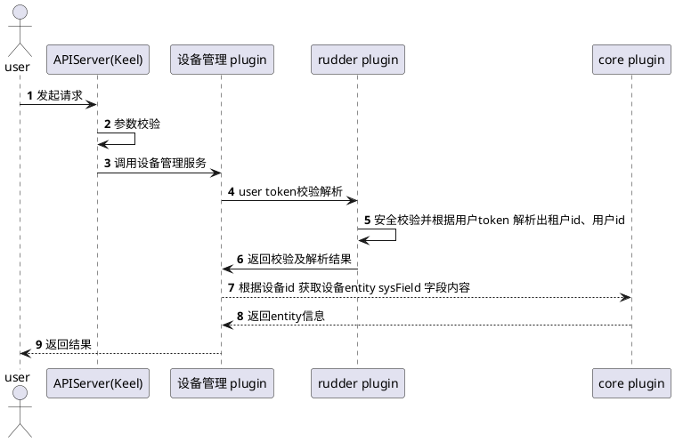
12、获取设备连接信息


13、 获取设备原始数据

14、获取设备属性数据


15、获取设备遥测数据
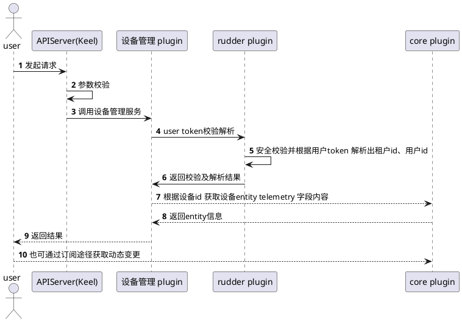
16、调用设备原始数据反控

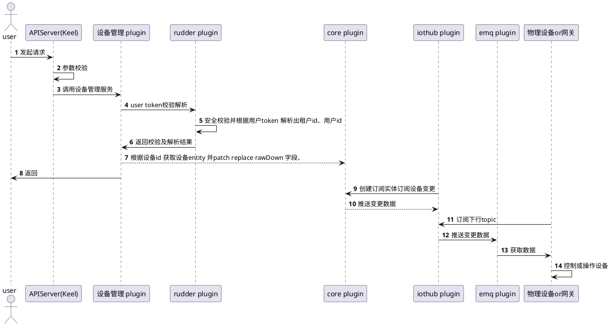

17、调用设备属性反控  或设置属性值

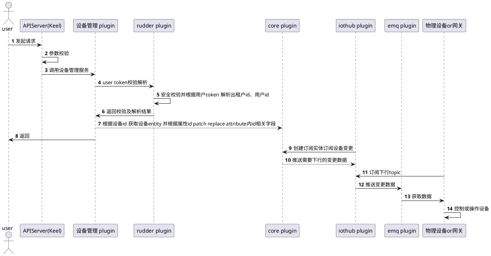
18、调用命令

```plantuml
@startuml
actor "user" as user
participant "APIServer(Keel)"  as keel
participant "设备管理 plugin"  as dev
participant "rudder plugin"  as rdr
participant "core plugin"  as core
participant "iothub plugin" as hub
participant "emq plugin" as emq 
participant "物理设备or网关" as pdev 
autonumber
user->keel:发起请求
keel->keel:参数校验
keel->dev:调用设备管理服务
dev->rdr:user token校验解析
rdr->rdr:安全校验并根据用户token 解析出租户id、用户id
rdr ->dev:返回校验及解析结果
dev-->core:根据设备id 获取设备entity 并patch replace commands 内相关id 中input 字段
dev->user: 返回
hub->core: 创建订阅实体订阅设备变更
core-->hub:推送变更数据
pdev->hub: 订阅下行topic
hub->emq:推送变更数据
emq->pdev:获取数据
pdev->pdev:控制或操作设备
pdev->emq:操作结果返回 如果有
hub->emq:获取结果
hub->core: 根据设备id 获取设备entity 并patch replace commands 内相关id 中output 字段
user-->core:也可通过订阅途径获取动态数据

@enduml
```
19 、创建设备映射关系
```plantuml
@startuml
actor "user" as user
participant "APIServer(Keel)"  as keel
participant "设备管理 plugin"  as dev
participant "rudder plugin"  as rdr
participant "core plugin"  as core
autonumber
user->keel:发起请求
keel->keel:参数校验
keel->dev:调用设备管理服务
dev->rdr:user token校验解析
rdr->rdr:安全校验并根据用户token 解析出租户id、用户id
rdr ->dev:返回校验及解析结果
dev->dev:根据信息构建数据映射expression
dev-->core:根据expression  在core中创建两个 entity  与 entity 之间的数据映射关系
core-->dev:返回信息
dev-->user:返回结果
@enduml
```
19.1 对象图
```plantuml
@startuml
object expression {
    path: 当前设备需要映射的数据字段id
    expression: 映射对端设备id + 类型（属性or 遥测）+ 数据字段id
    decscription：说明
    name: 表达式名称
}
@enduml
```

20 、修改设备数据映射关系
```plantuml
@startuml
actor "user" as user
participant "APIServer(Keel)"  as keel
participant "设备管理 plugin"  as dev
participant "rudder plugin"  as rdr
participant "core plugin"  as core
autonumber
user->keel:发起请求
keel->keel:参数校验
keel->dev:调用设备管理服务
dev->rdr:user token校验解析
rdr->rdr:安全校验并根据用户token 解析出租户id、用户id
rdr ->dev:返回校验及解析结果
dev->dev:根据修改信息构建新的数据映射expression
dev-->core:根据expression  replace 在core中创建两个 entity  与 entity 之间的数据映射关系
core-->dev:返回信息
dev-->user:返回结果
@enduml
```
21、 删除设备数据映射关系
```plantuml
@startuml
actor "user" as user
participant "APIServer(Keel)"  as keel
participant "设备管理 plugin"  as dev
participant "rudder plugin"  as rdr
participant "core plugin"  as core
autonumber
user->keel:发起请求
keel->keel:参数校验
keel->dev:调用设备管理服务
dev->rdr:user token校验解析
rdr->rdr:安全校验并根据用户token 解析出租户id、用户id
rdr ->dev:返回校验及解析结果
dev->dev:根据信息构建数据映射expression 
dev-->core:根据expression remove  在core中创建两个 entity  与 entity 之间的数据映射关系
core-->dev:返回信息
dev-->user:返回结果
@enduml
```
22、 获取设备数据映射关系
```plantuml
@startuml
actor "user" as user
participant "APIServer(Keel)"  as keel
participant "设备管理 plugin"  as dev
participant "rudder plugin"  as rdr
participant "core plugin"  as core
autonumber
user->keel:发起请求
keel->keel:参数校验
keel->dev:调用设备管理服务
dev->rdr:user token校验解析
rdr->rdr:安全校验并根据用户token 解析出租户id、用户id
rdr ->dev:返回校验及解析结果
dev-->core:根据设备id  获取此设备的所有数据映射关系expression列表
core-->dev:返回信息
dev-->user:返回结果
@enduml
```

23、 设备数据上行时序图
```plantuml
@startuml
participant "设备"  as gw
participant "emq"  as emq
participant "iothub plugin"  as iothub
participant "security plugin"  as sec
participant "core plugin"  as core
participant "后端设备管理 plugin"  as bdev 
participant "前端设备管理 plugin"  as fdev
participant "第三方应用 plugin"  as tp
autonumber

fdev->bdev: 定义数字化设备
bdev->core: 创建承载数字化设备实体
bdev-->sec: 申请设备token
sec-->bdev: 颁发设备token
bdev->fdev: 返回数字化设备信息（id、token等）
gw->emq: 连接、携带在平台注册设备颁发的token
emq->iothub: iothub hook 数据包
iothub->sec: 鉴权
sec->iothub: 成功 or  失败
iothub->emq: 成功or 失败
emq->gw: 成功or 失败
gw->emq: 推送自定义、属性、遥测数据
emq->iothub: iothub hook 数据包
iothub->core: 推送数据到core 
core<->core: 承载连接信息
core<->core: 承载原始数据
core<->core: 解析属性数据
core<->core: 解析遥测数据
fdev->bdev: 查询or订阅 设备基础信息、系统信息、连接信息、原始数据、属性数据、遥测数据等各维度数据
bdev->fdev: 返回数字化设备实体各维度数据
tp-->bdev: 查询or订阅 设备基础信息、系统信息、连接信息、原始数据、属性数据、遥测数据等各维度数据
bdev-->tp:22、返回数字化设备实体各维度数据
@enduml
```