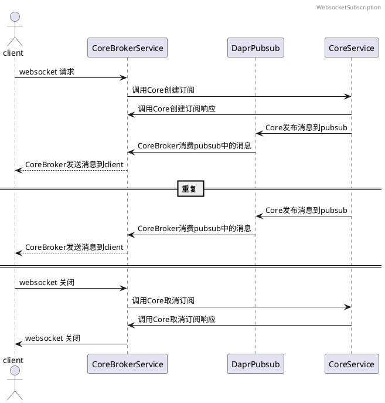
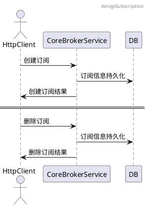
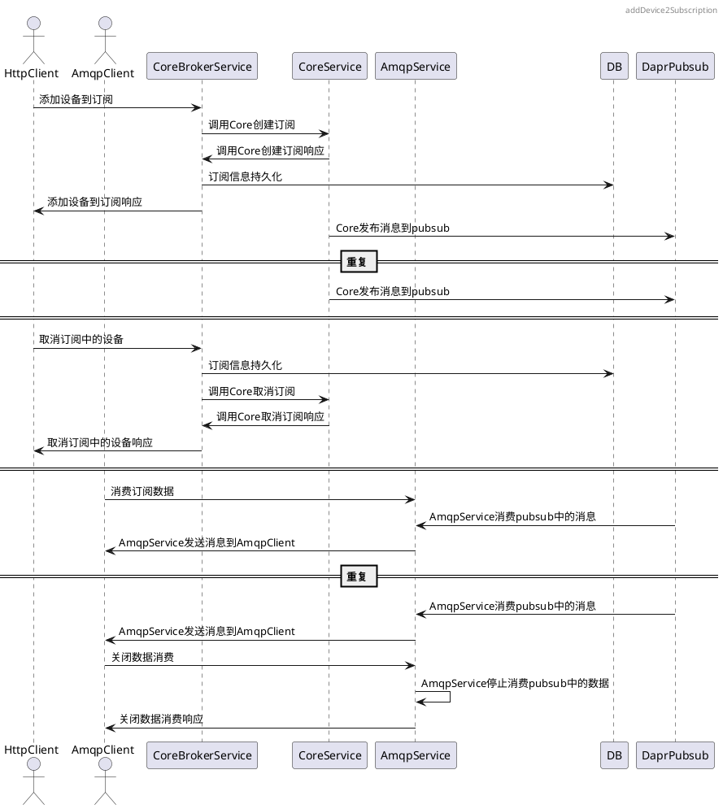

1. websocket订阅

```plantuml
@startuml
header WebsocketSubscription

actor client
participant CoreBrokerService
participant DaprPubsub
participant CoreService


client->CoreBrokerService:websocket 请求
CoreBrokerService->CoreService:调用Core创建订阅
CoreBrokerService<-CoreService:调用Core创建订阅响应
CoreService->DaprPubsub:Core发布消息到pubsub
DaprPubsub->CoreBrokerService:CoreBroker消费pubsub中的消息
CoreBrokerService-->client:CoreBroker发送消息到client

== 重复 ==
CoreService->DaprPubsub:Core发布消息到pubsub
DaprPubsub->CoreBrokerService:CoreBroker消费pubsub中的消息
CoreBrokerService-->client:CoreBroker发送消息到client

====
client->CoreBrokerService:websocket 关闭
CoreBrokerService->CoreService:调用Core取消订阅
CoreBrokerService<-CoreService:调用Core取消订阅响应
client<-CoreBrokerService:websocket 关闭
@enduml
```

2. amqp订阅

```plantuml
@startuml
header AmqpSubscription

actor HttpClient
participant CoreBrokerService
participant DB


HttpClient->CoreBrokerService:创建订阅
CoreBrokerService->DB:订阅信息持久化
CoreBrokerService->HttpClient:创建订阅结果
====
HttpClient->CoreBrokerService:删除订阅
CoreBrokerService->DB:订阅信息持久化
CoreBrokerService->HttpClient:删除订阅结果

@enduml
```

```plantuml
@startuml
header addDevice2Subscription

actor HttpClient
actor AmqpClient
participant CoreBrokerService
participant CoreService
participant AmqpService


HttpClient->CoreBrokerService:添加设备到订阅
CoreBrokerService->CoreService:调用Core创建订阅
CoreBrokerService<-CoreService:调用Core创建订阅响应
CoreBrokerService->DB:订阅信息持久化
HttpClient<-CoreBrokerService:添加设备到订阅响应
CoreService->DaprPubsub:Core发布消息到pubsub
== 重复 ==
CoreService->DaprPubsub:Core发布消息到pubsub

====
HttpClient->CoreBrokerService:取消订阅中的设备
CoreBrokerService->DB:订阅信息持久化
CoreBrokerService->CoreService:调用Core取消订阅
CoreBrokerService<-CoreService:调用Core取消订阅响应
HttpClient<-CoreBrokerService:取消订阅中的设备响应

====
AmqpClient->AmqpService:消费订阅数据

DaprPubsub->AmqpService:AmqpService消费pubsub中的消息
AmqpService->AmqpClient:AmqpService发送消息到AmqpClient
== 重复 ==
DaprPubsub->AmqpService:AmqpService消费pubsub中的消息
AmqpService->AmqpClient:AmqpService发送消息到AmqpClient

AmqpClient->AmqpService:关闭数据消费
AmqpService->AmqpService:AmqpService停止消费pubsub中的数据
AmqpClient<-AmqpService:关闭数据消费响应
@enduml
```