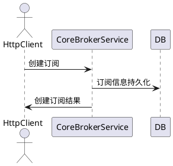
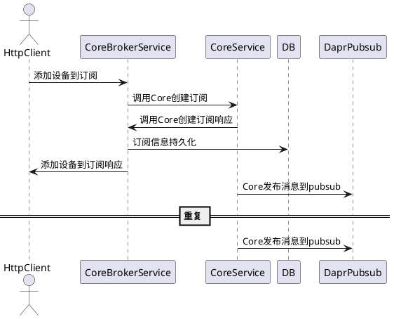
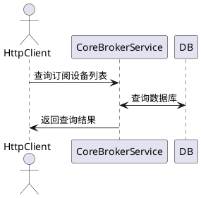
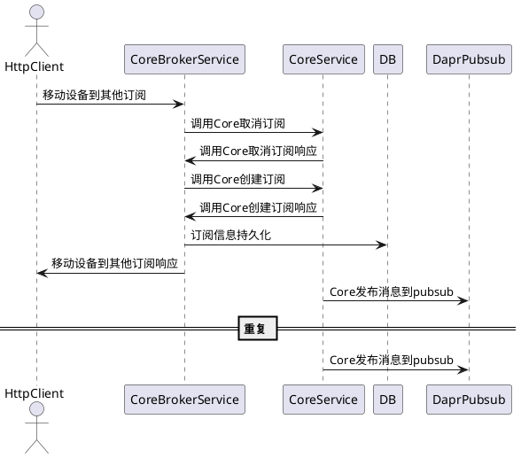
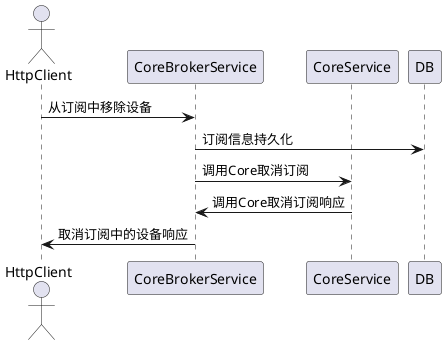
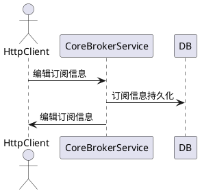
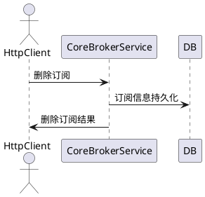
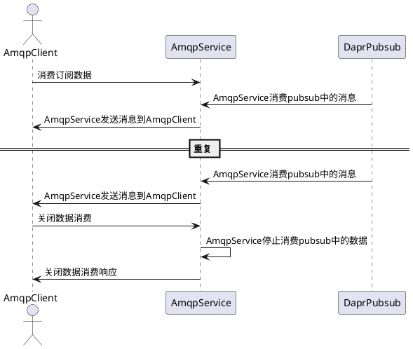
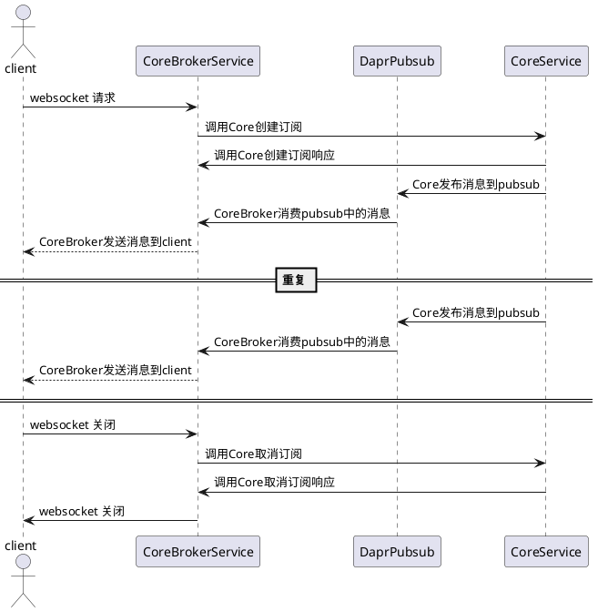

##### 1.3.6.1 创建订阅

```plantuml
@startuml
actor HttpClient
participant CoreBrokerService
participant DB


HttpClient->CoreBrokerService:创建订阅
CoreBrokerService->DB:订阅信息持久化
CoreBrokerService->HttpClient:创建订阅结果
@enduml
```
##### 1.3.6.2 为订阅添加设备

```plantuml
@startuml
actor HttpClient
participant CoreBrokerService
participant CoreService
participant DB
participant DaprPubsub

HttpClient->CoreBrokerService:添加设备到订阅
CoreBrokerService->CoreService:调用Core创建订阅
CoreBrokerService<-CoreService:调用Core创建订阅响应
CoreBrokerService->DB:订阅信息持久化
HttpClient<-CoreBrokerService:添加设备到订阅响应
CoreService->DaprPubsub:Core发布消息到pubsub
== 重复 ==
CoreService->DaprPubsub:Core发布消息到pubsub
@enduml
```
##### 1.3.6.3 查看订阅设备列表

```plantuml
@startuml
actor HttpClient
participant CoreBrokerService
participant DB

HttpClient->CoreBrokerService:查询订阅设备列表
CoreBrokerService<->DB:查询数据库
CoreBrokerService->HttpClient:返回查询结果
@enduml
```
##### 1.3.6.4 移动订阅

```plantuml
@startuml
actor HttpClient
participant CoreBrokerService
participant CoreService
participant DB
participant DaprPubsub

HttpClient->CoreBrokerService:移动设备到其他订阅
CoreBrokerService->CoreService:调用Core取消订阅
CoreBrokerService<-CoreService:调用Core取消订阅响应
CoreBrokerService->CoreService:调用Core创建订阅
CoreBrokerService<-CoreService:调用Core创建订阅响应
CoreBrokerService->DB:订阅信息持久化
HttpClient<-CoreBrokerService:移动设备到其他订阅响应
CoreService->DaprPubsub:Core发布消息到pubsub
== 重复 ==
CoreService->DaprPubsub:Core发布消息到pubsub
@enduml
```
##### 1.3.6.5 从订阅中移除设备

```plantuml
@startuml
actor HttpClient
participant CoreBrokerService
participant CoreService
participant DB

HttpClient->CoreBrokerService:从订阅中移除设备
CoreBrokerService->DB:订阅信息持久化
CoreBrokerService->CoreService:调用Core取消订阅
CoreBrokerService<-CoreService:调用Core取消订阅响应
HttpClient<-CoreBrokerService:取消订阅中的设备响应
@enduml
```
##### 1.3.6.6 编辑订阅信息

```plantuml
@startuml
actor HttpClient
participant CoreBrokerService
participant DB

HttpClient->CoreBrokerService:编辑订阅信息
CoreBrokerService->DB:订阅信息持久化
CoreBrokerService->HttpClient:编辑订阅信息
@enduml
```
##### 1.3.6.7 删除订阅

```plantuml
@startuml
actor HttpClient
participant CoreBrokerService
participant DB

HttpClient->CoreBrokerService:删除订阅
CoreBrokerService->DB:订阅信息持久化
CoreBrokerService->HttpClient:删除订阅结果
@enduml
```
##### 消费订阅数据

```plantuml
@startuml
actor AmqpClient
participant AmqpService
participant DaprPubsub
AmqpClient->AmqpService:消费订阅数据

DaprPubsub->AmqpService:AmqpService消费pubsub中的消息
AmqpService->AmqpClient:AmqpService发送消息到AmqpClient
== 重复 ==
DaprPubsub->AmqpService:AmqpService消费pubsub中的消息
AmqpService->AmqpClient:AmqpService发送消息到AmqpClient

AmqpClient->AmqpService:关闭数据消费
AmqpService->AmqpService:AmqpService停止消费pubsub中的数据
AmqpClient<-AmqpService:关闭数据消费响应
@enduml
```
##### websocket订阅

```plantuml
@startuml
actor client
participant CoreBrokerService
participant DaprPubsub
participant CoreService

client->CoreBrokerService:websocket 请求
CoreBrokerService->CoreService:调用Core创建订阅
CoreBrokerService<-CoreService:调用Core创建订阅响应
CoreService->DaprPubsub:Core发布消息到pubsub
DaprPubsub->CoreBrokerService:CoreBroker消费pubsub中的消息
CoreBrokerService-->client:CoreBroker发送消息到client

== 重复 ==
CoreService->DaprPubsub:Core发布消息到pubsub
DaprPubsub->CoreBrokerService:CoreBroker消费pubsub中的消息
CoreBrokerService-->client:CoreBroker发送消息到client

====
client->CoreBrokerService:websocket 关闭
CoreBrokerService->CoreService:调用Core取消订阅
CoreBrokerService<-CoreService:调用Core取消订阅响应
client<-CoreBrokerService:websocket 关闭
@enduml
```