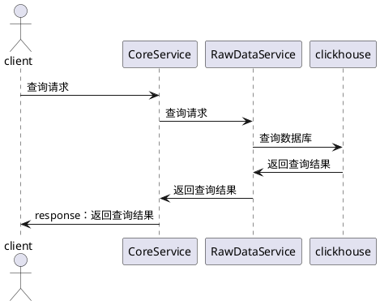
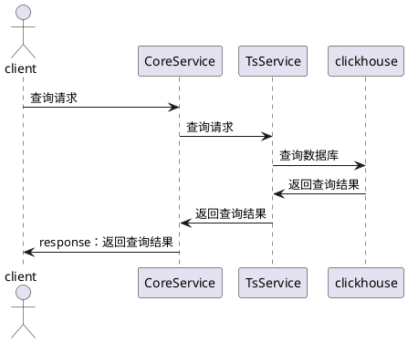

##### 1.3.7.1 查看设备原始数据

```plantuml
@startuml
actor client
participant CoreService
participant RawDataService
participant  clickhouse

client->CoreService: 查询请求
CoreService->RawDataService: 查询请求
RawDataService->clickhouse: 查询数据库
clickhouse->RawDataService: 返回查询结果
CoreService<-RawDataService: 返回查询结果
CoreService->client:response：返回查询结果
@enduml
```
##### 1.3.7.2 查看设备模板时序数据

```plantuml
@startuml
actor client
participant CoreService
participant TsService
participant  clickhouse

client->CoreService: 查询请求
CoreService->TsService: 查询请求
TsService->clickhouse: 查询数据库
clickhouse->TsService: 返回查询结果
CoreService<-TsService: 返回查询结果
CoreService->client:response：返回查询结果
@enduml
```
##### 1.3.7.3 导出数据结果
无