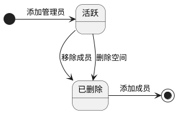
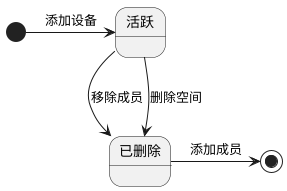

# 时序图示例
https://plantuml.com/zh/sequence-diagram

```plantuml
participant "用户" as user
participant "APIServer"  as keel
participant "SpaceManager"  as space
participant "持久层"  as dblayer
participant "Mysql"  as db
user -> keel : 发起请求
keel -> keel : 参数校验
keel --> space : 调用业务层
space --> dblayer : 调用DB层
dblayer --> db : 构造查询条件
dblayer --> db : 查询配额
db --> user : 返回结果
```

```plantuml
participant "用户" as user
participant "APIServer(Keel)"  as keel
participant "设备管理"  as device
participant "CoreService"  as core
participant "Redis"  as redis
participant "Mysql"  as mysql
participant "Clickhouse"  as ck
participant "ElasticSearch"  as es
user -> keel : 发起请求
keel -> keel : 参数校验
keel --> device : 调用业务层
device --> core : 调用DB层
core --> redis : 缓存状态
core --> mysql : 更新XXX
core --> ck : 更新时序数据
core --> es : 更新查询
core --> user : 返回结果
```


# 状态图示例
https://plantuml.com/zh/activity-diagram-beta#772273da3919bcd1






