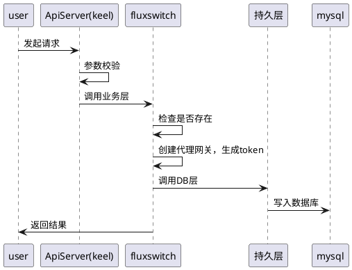
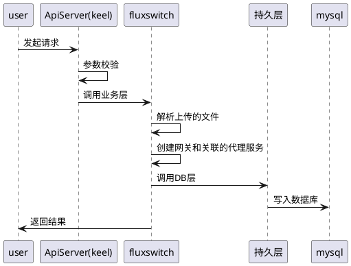
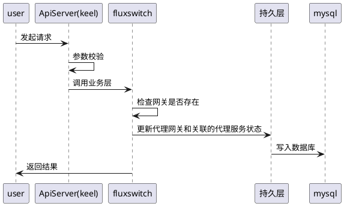
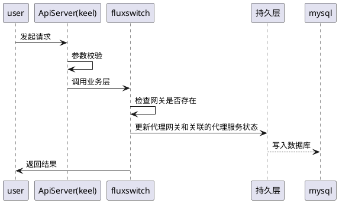
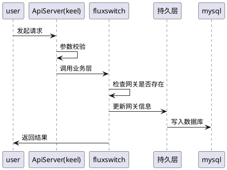
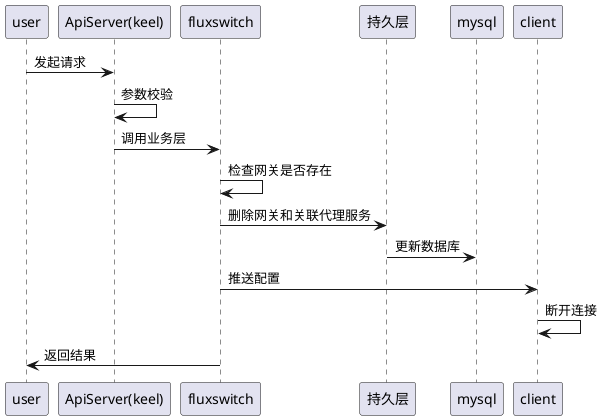
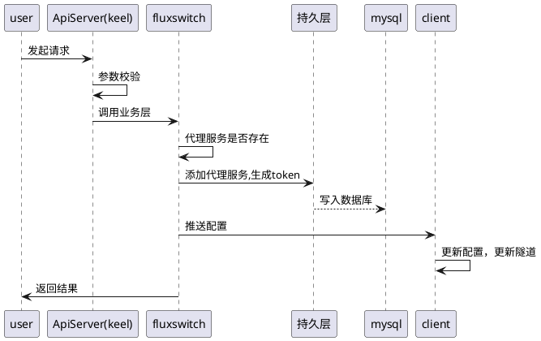
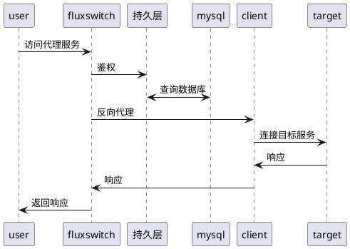
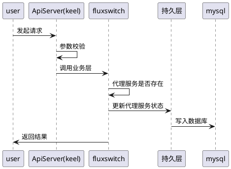
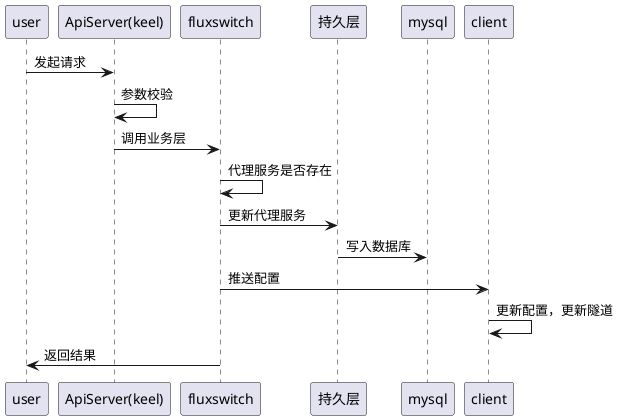

### 1.3.4 网络服务

#### 1.3.4.1 添加代理网关

##### 1.3.4.1.1 时序图

##### 1.3.4.1.2 状态图

不涉及

##### 1.3.4.1.3 表示层设计

#### 1.3.4.2 批量导入代理网关

##### 1.3.4.2.1 时序图

##### 1.3.4.2.2 状态图

不涉及

##### 1.3.4.2.3 表示层设计

#### 1.3.4.3 启用代理网关

##### 1.3.4.3.1 时序图

##### 1.3.4.3.2 状态图

不涉及

##### 1.3.4.3.3 表示层设计

#### 1.3.4.4 禁用代理网关

##### 1.3.4.4.1 时序图

##### 1.3.4.4.2 状态图

不涉及

##### 1.3.4.4.3 表示层设计

#### 1.3.4.5 编辑代理网关

##### 1.3.4.5.1 时序图

##### 1.3.4.5.2 状态图

不涉及

##### 1.3.4.5.3 表示层设计

#### 1.3.4.6 删除代理网关

##### 1.3.4.6.1 时序图

##### 1.3.4.6.2 状态图

不涉及

##### 1.3.4.6.3 表示层设计

#### 1.3.4.7 添加代理服务

##### 1.3.4.7.1 时序图

##### 1.3.4.7.2 状态图

不涉及

##### 1.3.4.7.3 表示层设计

#### 1.3.4.8 访问代理服务

##### 1.3.4.8.1 时序图

##### 1.3.4.8.2 状态图

不涉及

##### 1.3.4.8.3 表示层设计

#### 1.3.4.9 启用代理服务

##### 1.3.4.9.1 时序图

##### 1.3.4.9.2 状态图

不涉及

##### 1.3.4.9.3 表示层设计

#### 1.3.4.10 禁用代理服务

##### 1.3.4.10.1 时序图

##### 1.3.4.10.2 状态图

不涉及

##### 1.3.4.10.3 表示层设计

#### 1.3.4.11 编辑代理服务

##### 1.3.4.11.1 时序图

##### 1.3.4.11.2 状态图

不涉及

##### 1.3.4.11.3 表示层设计

#### 1.3.4.12 删除代理服务

##### 1.3.4.12.1 时序图

##### 1.3.4.12.2 状态图

不涉及

##### 1.3.4.12.3 表示层设计
