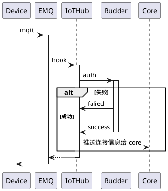
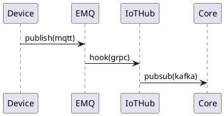
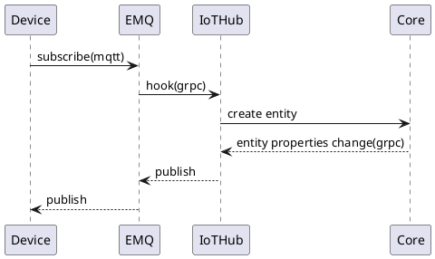

# IoTHub
## 连接到 IoTHub

```plantuml
@startuml
participant "Device" as device
participant "EMQ" as emq
participant "IoTHub"  as iothub
participant "Rudder"  as rudder
participant "Core"  as core

device->emq  ++--: mqtt
emq->iothub ++: hook

iothub->rudder ++: auth
alt 失败
    rudder->iothub: falied
else 成功
    rudder-->iothub--: success
    iothub->core: 推送连接信息给 core
end
iothub-->emq--
emq-->device--

@enduml
```

## 推送消息

```plantuml
@startuml
participant "Device" as device 
participant "EMQ" as emq 
participant "IoTHub"  as iothub
participant "Core"  as core

device->emq: publish(mqtt)
emq->iothub: hook(grpc)
iothub->core: pubsub(kafka)

@enduml
```

## 订阅消息

```plantuml
@startuml
participant "Device" as device 
participant "EMQ" as emq 
participant "IoTHub"  as iothub
participant "Core"  as core

device->emq: subscribe(mqtt)
emq->iothub: hook(grpc)
iothub->core: create entity

core-->iothub: entity properties change(grpc)
iothub-->emq: publish
emq-->device: publish

@enduml
```