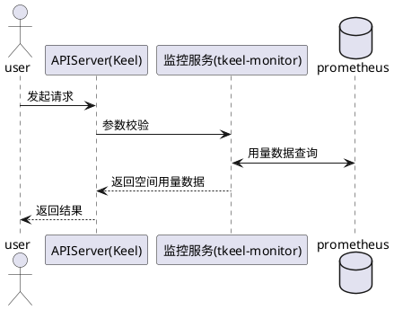
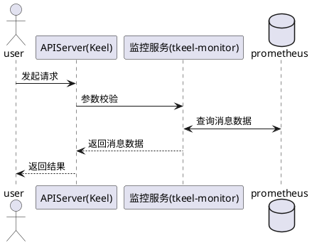
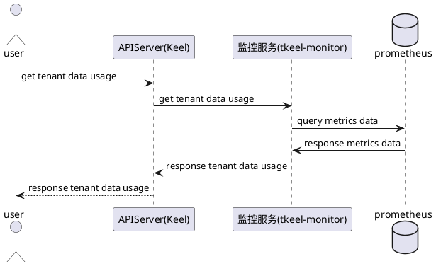
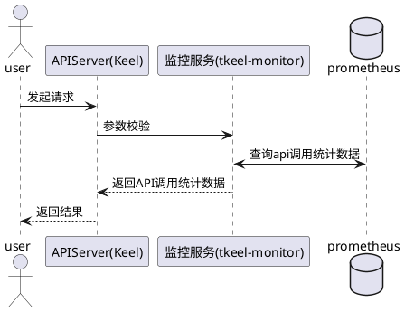

### 1.2.4 计量统计

#### 1.2.4.1 查看用户空间用量
##### 1.2.4.1.1 时序图

#### 1.2.4.2 查看用户空间消息数据统计
##### 1.2.4.1.1 时序图

#### 1.2.4.2 查看租户空间使用数据统计
##### 1.2.4.1.1 时序图

#### 1.2.4.2 查看用户空间API调用统计
##### 1.2.4.1.1 时序图

