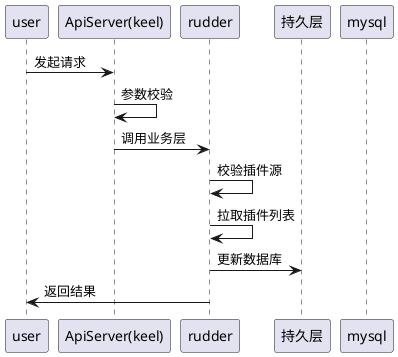
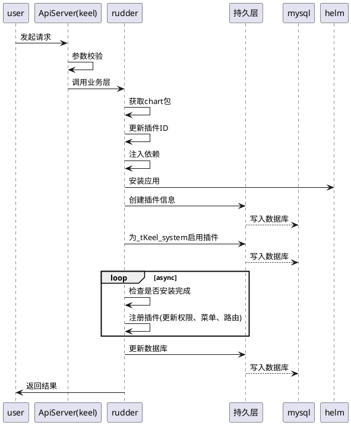
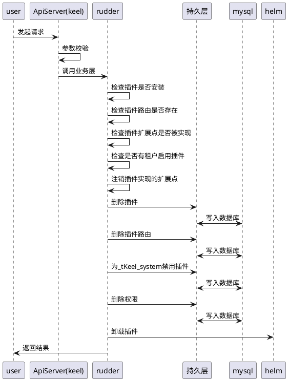
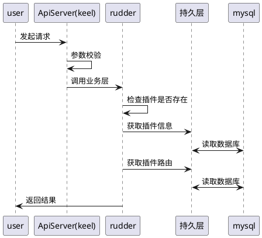
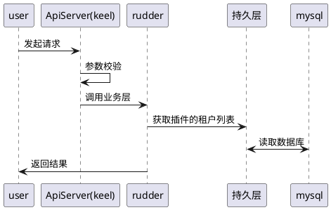

### 1.1.1 插件管理

#### 1.1.1.1 创建插件源

##### 1.1.1.1.1 时序图

##### 1.1.1.1.2 状态图

不涉及

##### 1.1.1.1.3 表示层设计

#### 1.1.1.2 安装插件

##### 1.1.1.2.1 时序图

##### 1.1.1.2.2 状态图

不涉及

##### 1.1.1.2.3 表示层设计

#### 1.1.1.3 卸载插件

##### 1.1.1.3.1 时序图

##### 1.1.1.3.2 状态图

不涉及

##### 1.1.1.3.3 表示层设计

#### 1.1.1.4 查看插件详情

##### 1.1.1.4.1 时序图

##### 1.1.1.4.2 状态图

不涉及

##### 1.1.1.4.3 表示层设计

#### 1.1.1.5 查看插件启用列表

##### 1.1.1.5.1 时序图

##### 1.1.1.5.2 状态图

不涉及

##### 1.1.1.5.3 表示层设计
