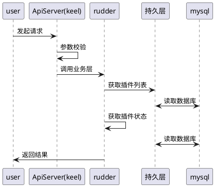
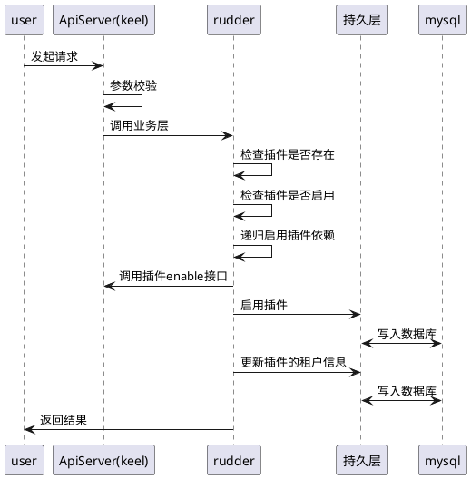
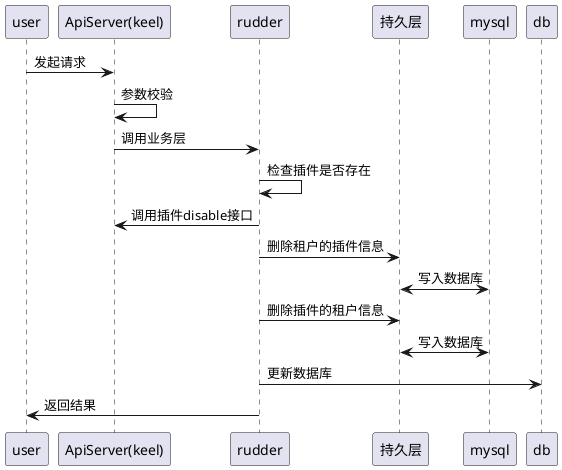
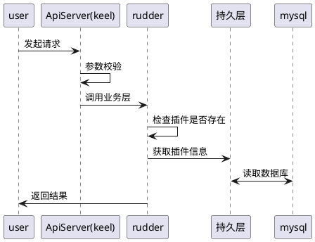

### 1.3.1 插件管理

#### 1.3.1.1 查看插件列表

##### 1.3.1.1.1 时序图

##### 1.3.1.1.2 状态图

不涉及

##### 1.3.1.1.3 表示层设计

#### 1.3.1.2 启用插件

##### 1.3.1.2.1 时序图

##### 1.3.1.2.2 状态图

不涉及

##### 1.3.1.2.3 表示层设计

#### 1.3.1.3 停用用插件

##### 1.3.1.3.1 时序图

##### 1.3.1.3.2 状态图

不涉及

##### 1.3.1.3.3 表示层设计

#### 1.3.1.4 查看插件详情

##### 1.3.1.4.1 时序图

##### 1.3.1.4.2 状态图

不涉及

##### 1.3.1.4.3 表示层设计
