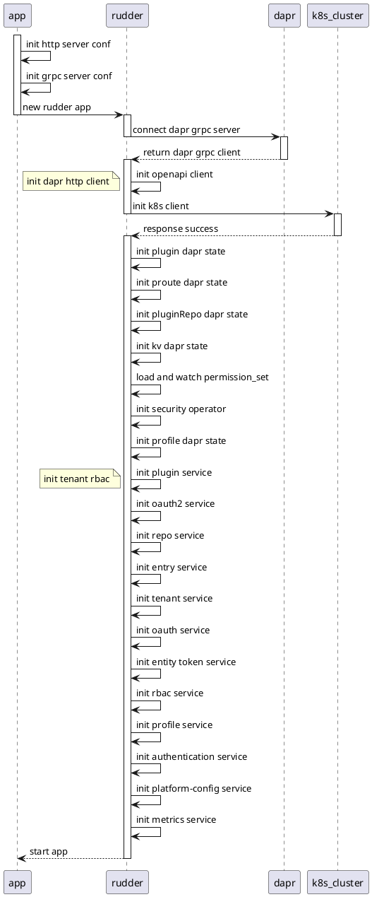
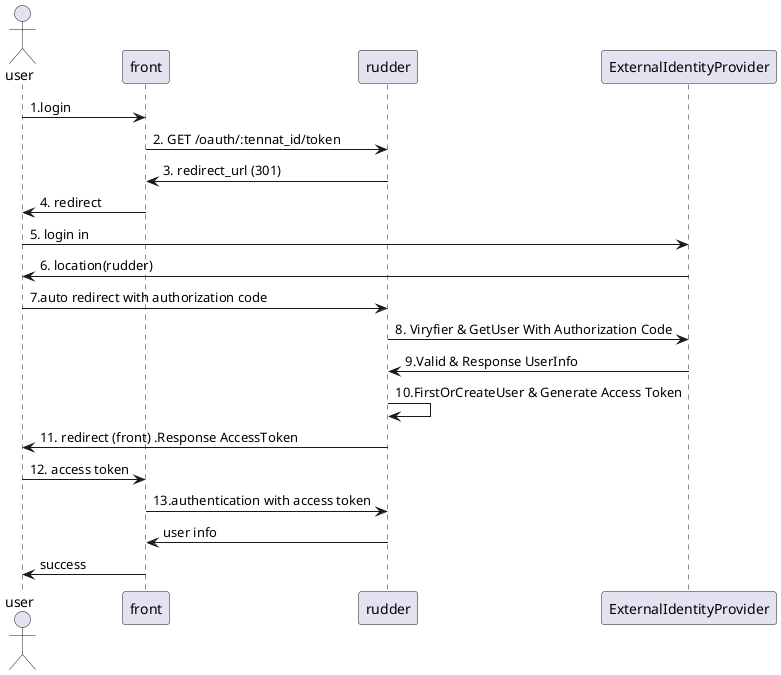

### 1.模块介绍

#### 1.1 keel
##### 1.1.1 时序
```plantuml
actor user 
participant keel 
participant rudder 

user->keel:request
activate keel
== auth ==
keel->keel:filter: /apis,/static
keel->keel:authenticate
keel->keel:callAuthorization
keel->rudder:/v1/authenticate
note left:dapr-http
deactivate keel

activate rudder
rudder->rudder:AuthenticationService
rudder->rudder:Authenticate
rudder-->keel:response success
deactivate rudder

activate keel
== proxy ==
keel->rudder:ProxyPlugin
note left:dapr-http
deactivate keel

activate rudder
rudder-->keel:reponse
deactivate rudder

activate keel
keel-->user:response
deactivate keel
```


##### 1.1.2 时序


##### 1.2.1 plugin service
1. ServiceInit
```plantuml
participant tenantPluginManager
tenantPluginManager->tenantPluginManager:create keel_system group prolicy
tenantPluginManager->tenantPluginManager:add tenant plugin prolicy
tenantPluginManager->tenantPluginManager:start service
```
2. InstallPlugin
```plantuml
actor user
participant pluginService
participant hubOp
participant helm_charts
participant pluginOp
participant tenantPluginOp
participant plugin
participant prouteOp
participant kvOp

user->pluginService:install plugin_info
pluginService->hubOp:repo_name
hubOp-->pluginService:repo_info
pluginService->helm_charts:download charts
pluginService->pluginService:helm api install plugin
pluginService->pluginOp:add plugin_info cache
note left: 1.all_plugins_cache\n2.plugin_info_cache
pluginService->tenantPluginOp:add tenant plugin rbac prolicy
pluginService->plugin:openapi client identity
plugin-->pluginService:response
pluginService->pluginService:checkIdentify
note left:1.check plugin status\n2.check plugin identity\n3.check tkeel version\n4.check plugin's cache info
pluginService->prouteOp:register plugin route cache
note left:1.create plugin route\n2.check ImplementedPlugin Route
pluginService->kvOp:add plugin permission set
pluginService->pluginOp:update plugin cache
pluginService-->user:reponse
```
3. UpgradePlugin
```plantuml
actor user
participant pluginService
participant hubOp
participant helm_charts
participant pluginOp
participant tenantPluginOp
participant prouteOp
participant kvOp

user->pluginService:request
pluginService->pluginOp:get plugin cache
pluginService->hubop:req install info
hubop-->pluginService:repo info
pluginService->helm_charts:download charts
pluginService->pluginService:Upgrade
pluginService->pluginOp:update plugin cache

pluginService->plugin:openapi client identity
plugin-->pluginService:response
pluginService->pluginService:checkIdentify
note left:1.check plugin status\n2.check plugin identity\n3.check tkeel version\n4.check plugin's cache info
pluginService->prouteOp:remove plugin route
pluginService->kvOp:remove permission set
pluginService->prouteOp:register plugin route cache
note left:1.create plugin route\n2.check ImplementedPlugin Route
pluginService->kvOp:add plugin permission set
pluginService->pluginOp:update plugin cache

pluginService-->user:response
```
4. UninstallPlugin
```plantuml
actor user
participant pluginService
participant hubOp
participant helm_charts
participant pluginOp
participant tenantPluginOp
participant pluginRouteOp
participant hubOp

user->pluginService:request
pluginService->pluginOp:get plugin cache
pluginService->pluginService:reset implemented plugin route
pluginService->pluginRouteOp:update plugin route
pluginService->pluginOp:remove plugin cache
pluginService->pluginRouteOp:remove plugin route
pluginService->tenantPluginOp:remove plugin rbac prolicy
pluginService->pluginService:remove permission set
pluginService->hubOp:helm api uninstall
pluginService->user:response
```
5. GetPlugin
```plantuml
actor user
participant pluginService
participant pluginOp
participant pluginRouteOp


user->pluginService:pluginId
pluginService->pluginOp:get plugin cache info
pluginOp-->pluginService:response success
pluginService->pluginRouteOp:get plugin route info
pluginRouteOp->pluginService:reponse success
pluginService-->user:reponse success
```
6. ListPlugin
```plantuml
actor user
participant pluginService
participant pluginOp

user->pluginService:request
pluginService->pluginOp:plugin list
pluginOp-->pluginService:get plugin cache
pluginService->pluginService:regexp keywords
pluginService->pluginService:pagination
pluginService->user:reponse
```
7. TenantEnable
```plantuml
actor user
participant pluginService
participant pluginOp
participant plugin

user->pluginService:pluginId
pluginService->pluginOp:plugin cache
pluginOp-->pluginService:reponse
pluginService->pluginService:check plugin enable
pluginService->pluginService:check plugin dependences
pluginService->pluginService:enable plugin
pluginService->plugin:openapi request::TenantDisable
plugin->plugin:plugin enable
plugin-->pluginService:reponse
pluginService->user:reponse
```
8. TenantDisable
```plantuml
actor user
participant pluginService
participant pluginOp
participant plugin
participant tenantPluginOp

user->pluginService:pluginId
pluginService->pluginOp:get plugin info
pluginOp-->pluginService:get plugin cache
pluginService->plugin:openapi request:TenantDisable
plugin->plugin:plugin disable
plugin-->pluginService:response
pluginService->tenantPluginOp:DeleteTenantPlugin
tenantPluginOp-->pluginService:response
pluginService->pluginOp:update plugin cache
pluginOp-->pluginService:response
pluginService-->user:response
```
9. ListEnabledTenants
```plantuml
actor user
participant pluginService
participant pluginOp

user->pluginService:request
pluginService->pluginOp:get all plugin list
pluginOp-->pluginService:get all plugin cache
pluginService->pluginService:regexp pluginId
pluginService->user:response
```
10. TMUpdatePluginIdentify
```plantuml
actor user
participant pluginService
participant pluginOp
participant plugin

user->pluginService:request
pluginService->plugin:openapi request:Identify
plugin-->pluginService:response
pluginService->pluginService:checkIdentify
pluginService->pluginOp:update plugin cache
pluginOp->pluginService:response
pluginService->user:response
```
11. TMRegisterPlugin
```plantuml
actor user
participant pluginService
participant pluginOp
participant plugin
participant pluginRouteOp

user->pluginService:request
pluginService->pluginOp:get plugin info
pluginOp-->pluginService:get plugin cache
pluginService->pluginRouteOp:delete plugin route cache
pluginService->plugin:openapi request::Identify
plugin->pluginService:response
pluginService->pluginService:checkIdentify
pluginService->pluginRouteOp:create plugin route
pluginService->pluginService:checkImplementedPluginRoute
pluginService->pluginRouteOp:get plugin route
pluginService->plugin:openapi request::AddonsIdentify
plugin-->pluginService:response
pluginService->pluginRouteOp:update plugin route
pluginService->kvOp:update permission set
pluginService->pluginOp:update plugin info
pluginOp-->pluginService:response
pluginService-->user:response
```
##### 1.2.2 tenant service
1.2.2.1 CreateTenant
```plantuml
actor user
participant tenantService
database rbacOp

user->tenantService:tenantId,Title,Remark
tenantService->rbacOp:create tenant model
tenantService->rbacOp:create tenant role model
tenantService->rbacOp:add policy: role permission in tenant
tenantService->rbacOp:add admin user
tenantService->rbacOp:add policy: admin user has role in tenant
tenantService->rbacOp:add group: admin user has user-sys-role in sys-tenant
tenantService->rbacOp:add policy: user-sys-role has permissin in sys-tenant
tenantService-->user:respnse
```
1.2.2.2 UpdateTenant
```plantuml
actor user
participant tenantService
participant rbacOp

user->tenantService:tenantId,Titile,Remark
tenantService->rbacOp:update tenant model
tenantService-->user:response
```
1.2.2.3 DeleteTenant
```plantuml
actor user
participant tenantService
database rbacOp

user->tenantService:tenantId
tenantService->rbacOp:remove tenant-role policy
tenantService->rbacOp:remove tenant-user-role group-policy
tenantService->rbacOp:delete tenant's role mode
tenantService->rbacOp:delete tenant model
tenantService->rbacOp:delete tenant's user model
tenantService->rbacOp:delete tenant's plugin-role policy
tenantService-->user:response
```
1.2.2.4 ListUser
```plantuml

header ListUser

actor user
participant tenantService
database DB

user->tenantService:request
tenantService->DB:call: List User
DB->tenantService: response user list
tenantService-->user:response

```
1.2.2.5 ResetUserPassword

```plantuml

header ResetUserPassword

actor user
participant tenantService
database DB

user->tenantService:request
tenantService->DB:call: update User
DB->tenantService: response update user
tenantService-->user:response

```
1.2.2.6 LoginWithExternalIdentityProvider



3. GetTenant
```plantuml
actor user
participant tenantService
participant rbacOp

user->tenantService:tenantId
tenantService->rbacOp:get tenant's list
tenantService->rbacOp:get tenant's role
tenantService->rbacOp:get tenant's user
tenantService-->user:response
```

4. 
5. CreateUser
```plantuml

header CreateUser

actor user
participant tenantService
database rbacOp
database DB

user->tenantService:request
tenantService->DB:call: create User
tenantService->rbacOp:call: AddGroupingPolicies
tenantService-->user:response

```
6. DeleteUser
```plantuml

header DeleteUser

actor user
participant tenantService
database rbacOp
database DB

user->tenantService:request: user_id,tenant_id
tenantService->DB:delete User
tenantService->rbacOp:call: DeleteUser(Group and Policy)
tenantService-->user:response

```
##### 1.2.3 server monitor
1.2.3.1 server list

```plantuml
actor user
participant tkeelMmonitor
participant kubesphere

user->tkeelMmonitor: get server list
tkeelMmonitor->kubesphere: get workload status
kubesphere->tkeelMmonitor: response workload status
tkeelMmonitor->user: response server list
```
1.2.3.2 server server usage 
```plantuml
actor user
participant tkeelMmonitor
participant kubesphere

user->tkeelMmonitor: get  server usage 
tkeelMmonitor->kubesphere: get workload status
kubesphere->tkeelMmonitor: response workload status
tkeelMmonitor->user: response server usage 
```
##### 1.2.4 metrics monitor
1.2.4.1 tenant usage overview
```plantuml
actor user
participant tkeelMmonitor
database prometheus

user->tkeelMmonitor: get tenant usage overview
tkeelMmonitor->prometheus: query metrics data 
prometheus->tkeelMmonitor: response metrics data 
tkeelMmonitor->user: response tenant usage overview
```

1.2.4.2 massage usage
```plantuml
actor user
participant tkeelMmonitor
database prometheus

user->tkeelMmonitor: get tenant massage usage
tkeelMmonitor->prometheus: query metrics data 
prometheus->tkeelMmonitor: response metrics data 
tkeelMmonitor->user: response tenant massage usage
```

1.2.4.3 data usage
```plantuml
actor user
participant tkeelMmonitor
database prometheus

user->tkeelMmonitor: get tenant data usage
tkeelMmonitor->prometheus: query metrics data 
prometheus->tkeelMmonitor: response metrics data 
tkeelMmonitor->user: response tenant data usage
```

1.2.4.4 api usage
```plantuml
actor user
participant tkeelMmonitor
database prometheus

user->tkeelMmonitor: get tenant api usage
tkeelMmonitor->prometheus: query metrics data 
prometheus->tkeelMmonitor: response metrics data 
tkeelMmonitor->user: response tenant api usage
```

##### 1.3.1 plugin manager
1.3.1.1 list plugin
```plantuml
actor user
participant pluginService
participant pluginOp

user->pluginService:request
pluginService->pluginOp:plugin list
pluginOp-->pluginService:get plugin cache
pluginService->pluginService:regexp keywords
pluginService->pluginService:pagination
pluginService->user:reponse
```
1.3.1.2 enable plugin
```plantuml
actor user
participant pluginService
participant pluginOp
participant plugin

user->pluginService:pluginId
pluginService->pluginOp:plugin cache
pluginOp-->pluginService:reponse
pluginService->pluginService:check plugin enable
pluginService->pluginService:check plugin dependences
pluginService->pluginService:enable plugin
pluginService->plugin:openapi request::TenantDisable
plugin->plugin:plugin enable
plugin-->pluginService:reponse
pluginService->user:reponse
```
1.3.1.3 disable plugin
```plantuml
actor user
participant pluginService
participant pluginOp
participant plugin
participant tenantPluginOp

user->pluginService:pluginId
pluginService->pluginOp:get plugin info
pluginOp-->pluginService:get plugin cache
pluginService->plugin:openapi request:TenantDisable
plugin->plugin:plugin disable
plugin-->pluginService:response
pluginService->tenantPluginOp:DeleteTenantPlugin
tenantPluginOp-->pluginService:response
pluginService->pluginOp:update plugin cache
pluginOp-->pluginService:response
pluginService-->user:response
```
1.3.1.4 get plugin
```plantuml
actor user
participant pluginService
participant pluginOp
participant pluginRouteOp


user->pluginService:pluginId
pluginService->pluginOp:get plugin cache info
pluginOp-->pluginService:response success
pluginService->pluginRouteOp:get plugin route info
pluginRouteOp->pluginService:reponse success
pluginService-->user:reponse success
```

##### 1.3.9 user manager
1.3.9.1 creat role
```plantuml

header CreateRole

actor user
participant rbacService
database DB
database rbacOp
participant PermissionSet

user->rbacService:request
rbacService->DB:create role
rbacService->PermissionSet:GetPermissionPathSet
rbacService->rbacOp:call:AddPolicy
rbacService-->user:response

```
1.3.9.2 list role 
```plantuml

header ListRole

actor user
participant rbacService
database DB
user->rbacService:request
rbacService->DB:query roles
DB->rbacService: response roles
rbacService-->user:response

```
1.3.9.3 update role 
```plantuml

header UpdateRole

actor user
participant rbacService
database DB
user->rbacService:request
rbacService->DB:update roles
DB->rbacService:  roles update response
rbacService-->user:response

```
1.3.9.4 delete role 
```plantuml

header DeleteRole

actor user
participant rbacService
database DB
database rbacOp
user->rbacService:request
rbacService->DB:getDeleteRole
rbacService->rbacOp:deleteRoleInTenant:remove policy and group
rbacService->DB:deleteRole
rbacService-->user:response

```
1.3.9.5 create user
```plantuml

header CreateUser
actor user
participant TenantService
database DB
user->TenantService: create user
TenantService->DB: insert user
DB->TenantService: insert user success
TenantService->user:create user success
```
1.3.9.6 update user
```plantuml

header UpdateUser
actor user
participant TenantService
database DB
user->TenantService: update  user
TenantService->DB: update user
DB->TenantService: update user success
TenantService->user:update user success
```
1.3.9.7 list user
```plantuml

header ListUser
actor user
participant TenantService
database DB
user->TenantService: get user list
TenantService->DB: select  user
DB->TenantService: select user success
TenantService->user:get user list success
```
1.3.9.8 reset user password
```plantuml

header ResetUserPassword

actor user
participant TenantService
database DB
user->TenantService: update  user password
TenantService->DB: get user
DB->TenantService: get user success
TenantService->DB: update user password
DB->TenantService: update user password success
TenantService->user:update user password success
```
1.3.9.9 delete user
```plantuml

header DeleteUser

actor user
participant TenantService
database DB
user->TenantService: delete user
TenantService->DB: delete user
DB->TenantService: delete user success
TenantService->user:delete user success
```
1.3.9.10 login 
```plantuml

header CreateUser

actor user
participant TenantService
database DB
user->TenantService: user login 
TenantService->DB: get user
DB->TenantService: get user success
TenantService->DB: valid password
DB->TenantService: valid password success
TenantService->user: login success
```


