### 1 管理平台插件子模块

#### 1.1 插件管理
##### 1.1.1 创建插件源
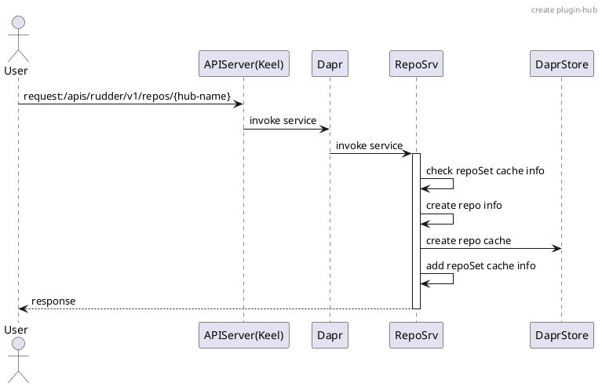
##### 1.1.2 安装插件
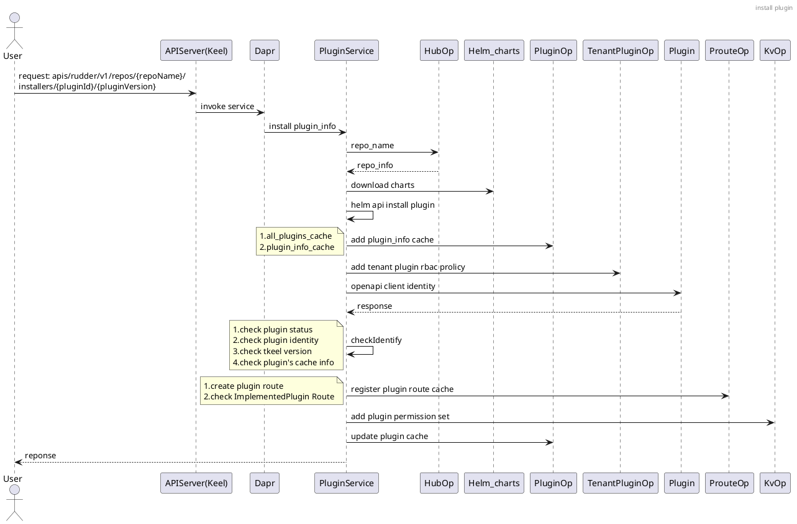
##### 1.1.3 卸载插件
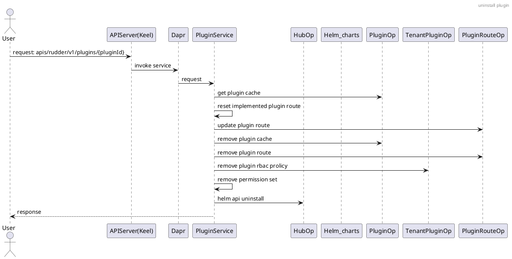
##### 1.1.4 查看插件详情
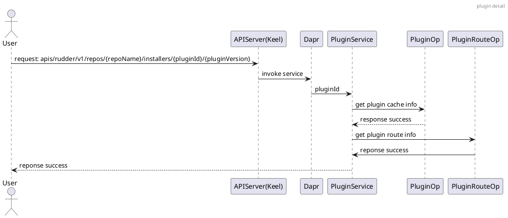
##### 1.1.5 查看启用插件列表
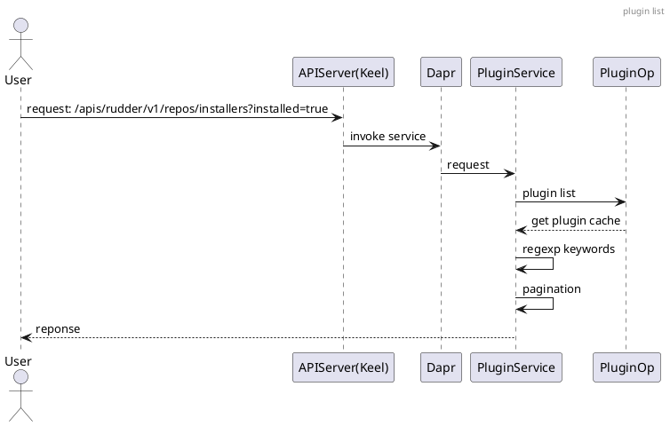

#### 1.2 租户管理

##### 1.2.1 创建租户空间
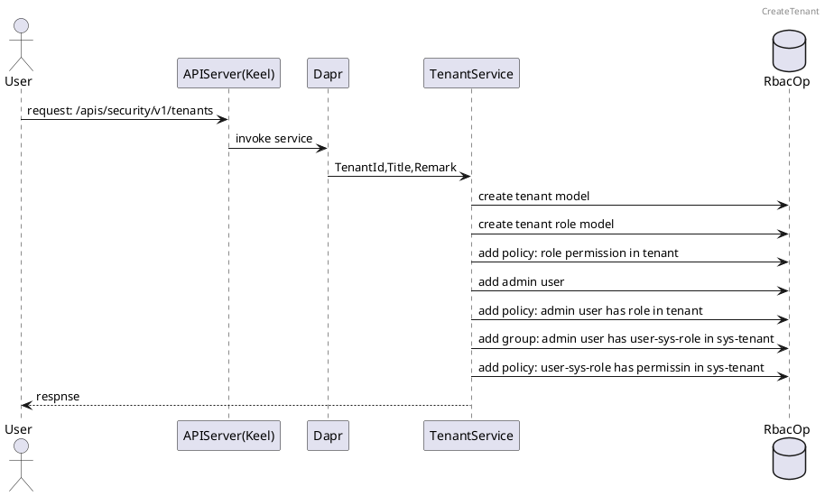
##### 1.2.2 编辑租户空间
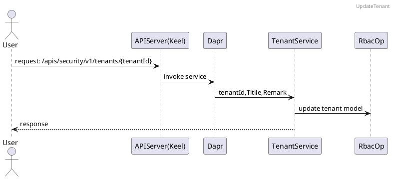
##### 1.2.3 删除租户空间
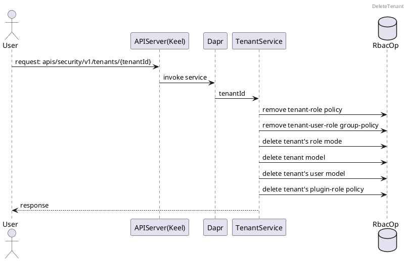
##### 1.2.4 查看用户列表
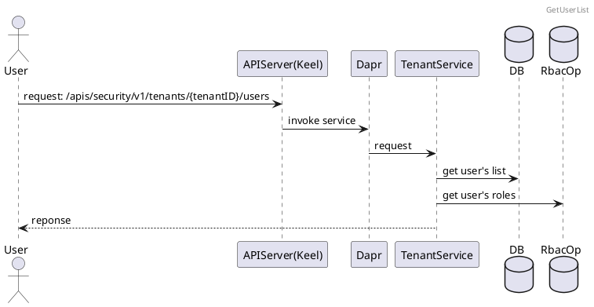
##### 1.2.5 为用户重置密码
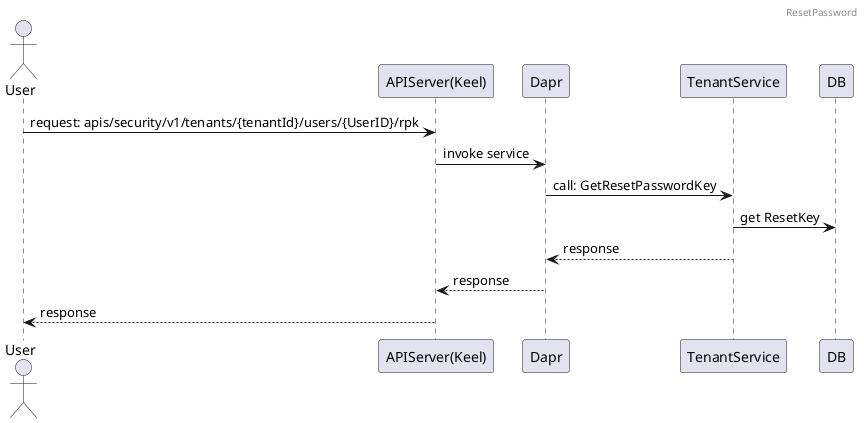
##### 1.2.6 单点登陆
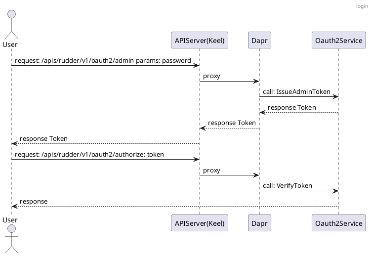


### 2 租户平台插件子模块

#### 2.1 插件管理
##### 2.1.1 查看插件列表
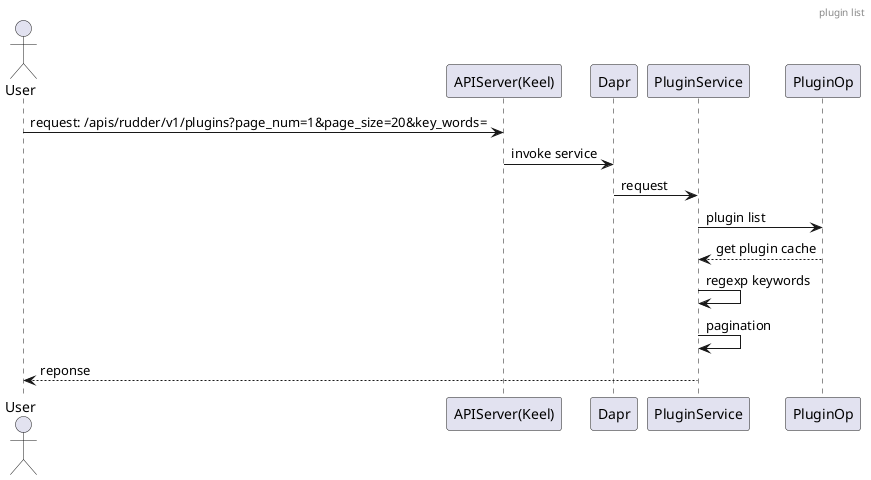
##### 2.1.2 启用插件
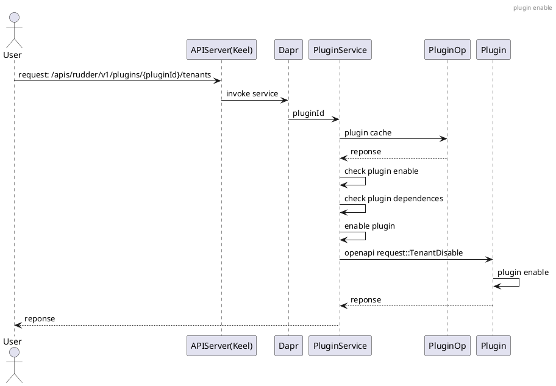
##### 2.1.3 停用插件
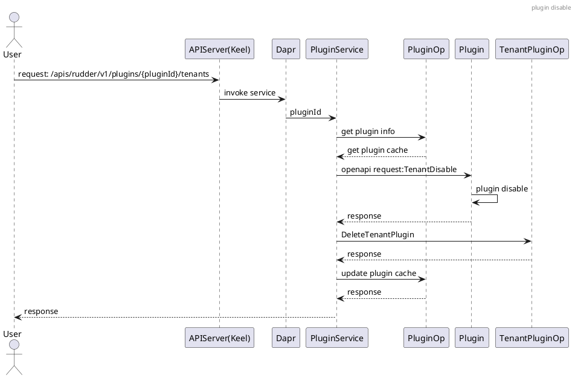
##### 2.1.4 查看插件详情
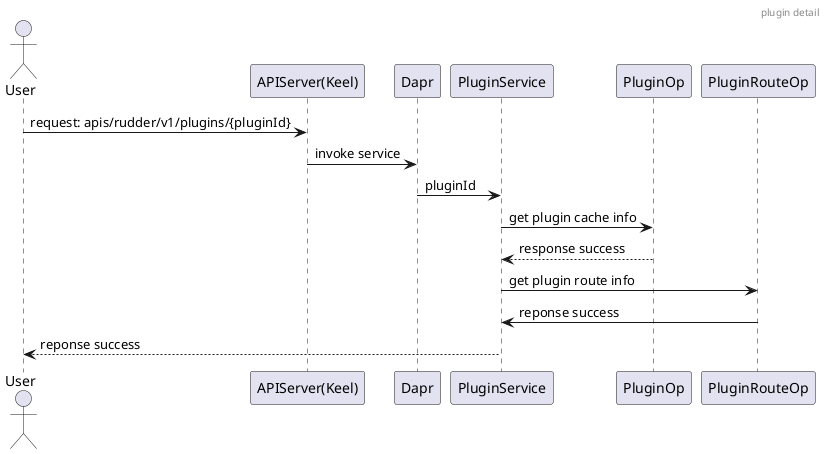


#### 2.2 用户管理

##### 2.2.1 创建角色
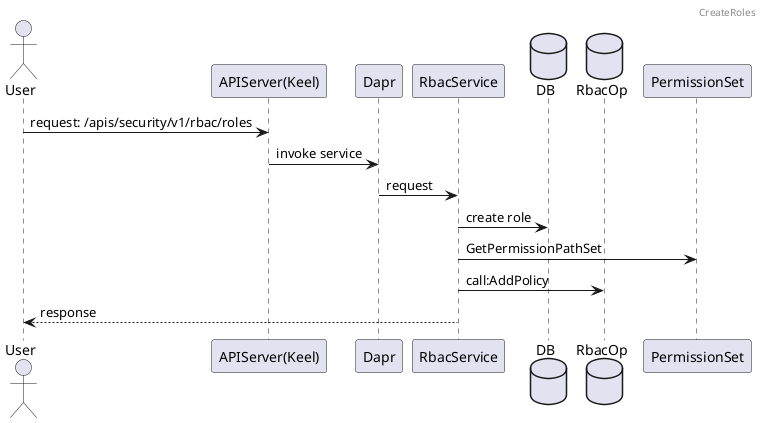
##### 2.2.2 查看角色列表
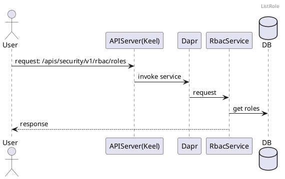
##### 2.2.3 编辑角色
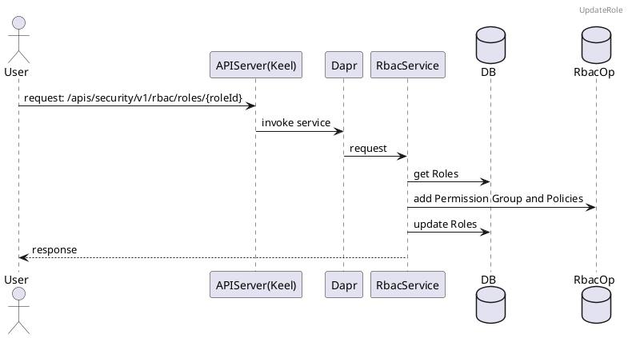
##### 2.2.4 删除角色
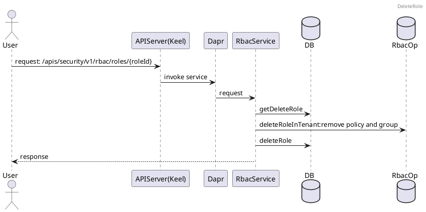
##### 2.2.5 创建用户
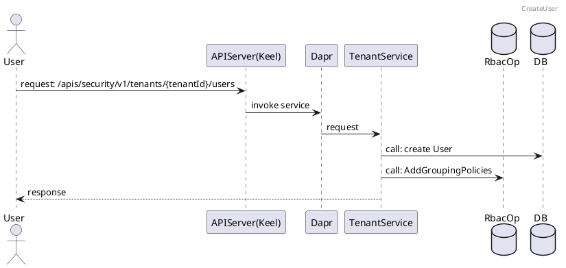
##### 2.2.6 编辑用户信息
```plantuml
@startuml
header UpdateUser

actor User
participant "APIServer(Keel)"  as Keel
participant Dapr
participant TenantService
database RbacOp
database DB

User->Keel:request: apis/security/v1/tenants/{tenantId}/users/{userId}
Keel->Dapr:invoke service
Dapr->TenantService:request
TenantService->RbacOp:add Perission Group and Policies
TenantService->DB:update User model
TenantService-->User:response
@enduml
```
##### 2.2.7 查看用户列表
```plantuml
@startuml
header GetUserList

actor User
participant "APIServer(Keel)"  as Keel
participant Dapr
participant TenantService
database DB
database RbacOp

User->Keel:request: /apis/security/v1/tenants/{tenantId}/users
Keel->Dapr:invoke service
Dapr->TenantService:request
TenantService->DB:get User's list
TenantService->RbacOp: get User's roles
TenantService-->User:reponse
@enduml
```
##### 2.2.8 重置密码
```plantuml
@startuml
header ResetPassword

actor User
participant "APIServer(Keel)"  as Keel
participant Dapr
participant TenantService
participant DB

User->Keel:request: /apis/security/v1/tenants/{tenantId}/users/{userId}/rpk
Keel->Dapr:invoke service
Dapr->TenantService:request: ResetKey
TenantService->DB:update User password
TenantService-->User:response
@enduml
```
##### 2.2.9 删除用户
```plantuml
@startuml
header DeleteUser

actor User
participant "APIServer(Keel)"  as Keel
participant Dapr
participant TenantService
database RbacOp
database DB

User->Keel:request: /apis/security/v1/tenants/{tenantId}/users/{userId}
Keel->Dapr:invoke service
Dapr->TenantService:request: user_id,tenant_id
TenantService->DB:delete User
TenantService->RbacOp:call: DeleteUser(Group and Policy)
TenantService-->User:response
@enduml
```
##### 2.2.10 登陆平台
```plantuml
@startuml
header login

actor User
participant "APIServer(Keel)"  as Keel
participant Dapr
participant TenantService
participant OauthService
participant DB

User->Keel:request: /apis/security/v1/tenants/exact?title
Keel->Dapr:proxy
Dapr->TenantService: call:TenantByExactSearch
TenantService-->User: tenant info

User->Keel:request: /apis/security/v1/oauth/{tenantId}/token
Keel->Dapr:proxy
Dapr->OauthService: call: Token
OauthService->OauthService: call: ValidationTokenRequest
OauthService->OauthService: call: model.AuthenticateUser
OauthService->DB:identity User
OauthService-->User:response
@enduml
```