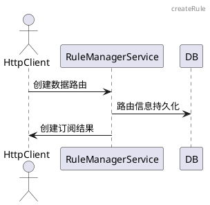
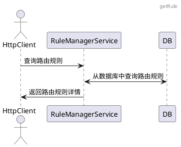
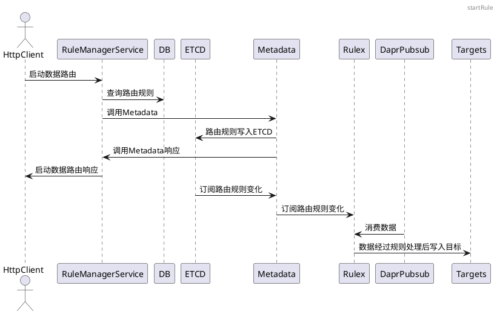
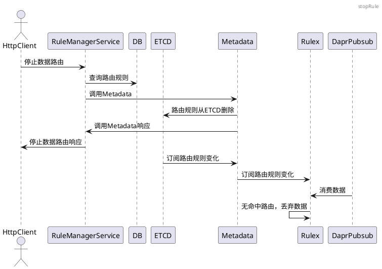
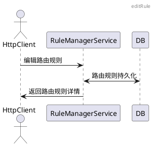
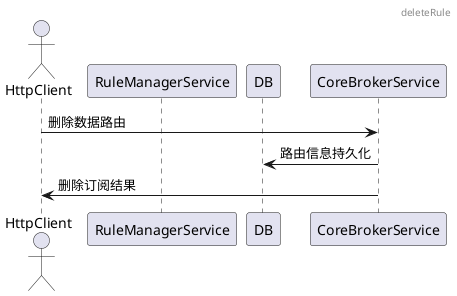
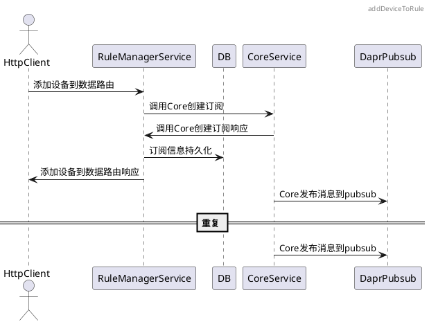
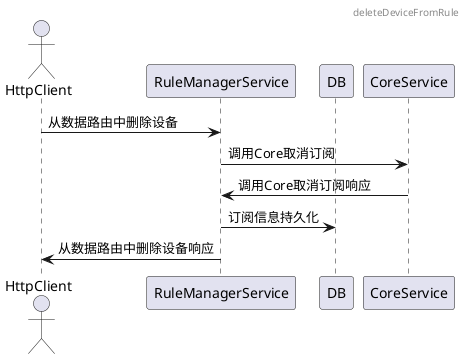

##### 1.3.8.1 创建路由规则

```plantuml
@startuml
header createRule

actor HttpClient
participant RuleManagerService
participant DB

HttpClient->RuleManagerService:创建数据路由
RuleManagerService->DB:路由信息持久化
RuleManagerService->HttpClient:创建订阅结果
@enduml
```
##### 1.3.8.2 查询路由规则详情

```plantuml
@startuml
header getRule

actor HttpClient
participant RuleManagerService
participant DB

HttpClient->RuleManagerService:查询路由规则
RuleManagerService<->DB:从数据库中查询路由规则
RuleManagerService->HttpClient:返回路由规则详情
@enduml
```
##### 1.3.8.3 启动路由规则

```plantuml
@startuml
header startRule

actor HttpClient
participant RuleManagerService
participant DB
participant ETCD
participant Metadata
participant Rulex
participant DaprPubsub
participant Targets

HttpClient->RuleManagerService:启动数据路由
RuleManagerService->DB:查询路由规则
RuleManagerService->Metadata:调用Metadata
Metadata->ETCD:路由规则写入ETCD
RuleManagerService<-Metadata:调用Metadata响应
HttpClient<-RuleManagerService:启动数据路由响应
ETCD->Metadata:订阅路由规则变化
Rulex<-Metadata:订阅路由规则变化
Rulex<-DaprPubsub:消费数据
Rulex->Targets:数据经过规则处理后写入目标
@enduml
```
##### 1.3.8.4 停止路由规则

```plantuml
@startuml
header stopRule

actor HttpClient
participant RuleManagerService
participant DB
participant ETCD
participant Metadata
participant Rulex
participant DaprPubsub

HttpClient->RuleManagerService:停止数据路由
RuleManagerService->DB:查询路由规则
RuleManagerService->Metadata:调用Metadata
Metadata->ETCD:路由规则从ETCD删除
RuleManagerService<-Metadata:调用Metadata响应
HttpClient<-RuleManagerService:停止数据路由响应
ETCD->Metadata:订阅路由规则变化
Rulex<-Metadata:订阅路由规则变化
Rulex<-DaprPubsub:消费数据
Rulex<-Rulex:无命中路由，丢弃数据
@enduml
```
##### 1.3.8.5 编辑路由规则

```plantuml
@startuml
header editRule

actor HttpClient
participant RuleManagerService
participant DB

HttpClient->RuleManagerService:编辑路由规则
RuleManagerService<->DB:路由规则持久化
RuleManagerService->HttpClient:返回路由规则详情
@enduml
```
##### 1.3.8.6 删除路由规则

```plantuml
@startuml
header deleteRule

actor HttpClient
participant RuleManagerService
participant DB

HttpClient->CoreBrokerService:删除数据路由
CoreBrokerService->DB:路由信息持久化
CoreBrokerService->HttpClient:删除订阅结果
@enduml
```
#### 添加设备到数据路由

```plantuml
@startuml
header addDeviceToRule

actor HttpClient
participant RuleManagerService
participant DB
participant CoreService
participant DaprPubsub

HttpClient->RuleManagerService:添加设备到数据路由
RuleManagerService->CoreService:调用Core创建订阅
RuleManagerService<-CoreService:调用Core创建订阅响应
RuleManagerService->DB:订阅信息持久化
HttpClient<-RuleManagerService:添加设备到数据路由响应

CoreService->DaprPubsub:Core发布消息到pubsub
== 重复 ==
CoreService->DaprPubsub:Core发布消息到pubsub
@enduml
```
#### 从数据路由中删除设备

```plantuml
@startuml
header deleteDeviceFromRule

actor HttpClient
participant RuleManagerService
participant DB

HttpClient->RuleManagerService:从数据路由中删除设备
RuleManagerService->CoreService:调用Core取消订阅
RuleManagerService<-CoreService:调用Core取消订阅响应
RuleManagerService->DB:订阅信息持久化
HttpClient<-RuleManagerService:从数据路由中删除设备响应
@enduml
```