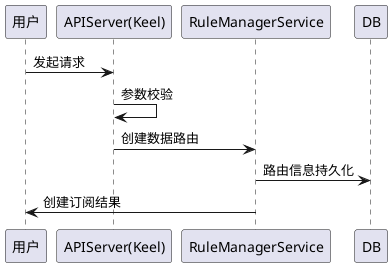
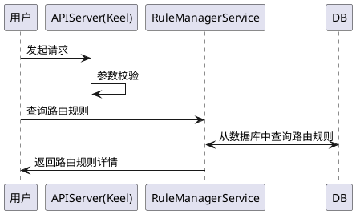
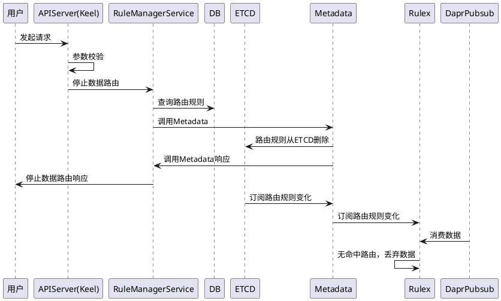
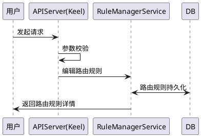
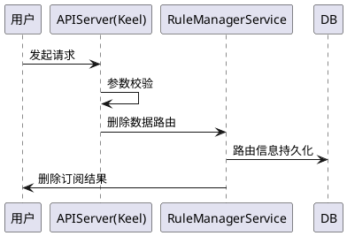
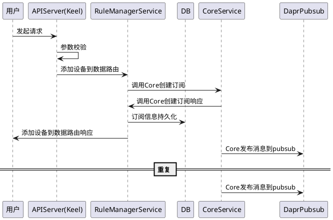
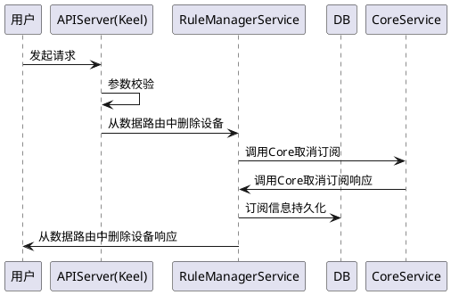

##### 1.3.8.1 创建路由规则

##### 1.3.8.2 查询路由规则详情

##### 1.3.8.3 启动路由规则
```plantuml

participant "用户" as user
participant "APIServer(Keel)"  as keel
participant RuleManagerService
participant DB
participant ETCD
participant Metadata
participant Rulex
participant DaprPubsub
participant Targets

user->keel: 发起请求
keel->keel: 参数校验
keel->RuleManagerService:启动数据路由
RuleManagerService->DB:查询路由规则
RuleManagerService->Metadata:调用Metadata
Metadata->ETCD:路由规则写入ETCD
RuleManagerService<-Metadata:调用Metadata响应
user<-RuleManagerService:启动数据路由响应
ETCD->Metadata:订阅路由规则变化
Rulex<-Metadata:订阅路由规则变化
Rulex<-DaprPubsub:消费数据
Rulex->Targets:数据经过规则处理后写入目标
@enduml
```
##### 1.3.8.4 停止路由规则

##### 1.3.8.5 编辑路由规则

##### 1.3.8.6 删除路由规则

#### 添加设备到数据路由

#### 从数据路由中删除设备
