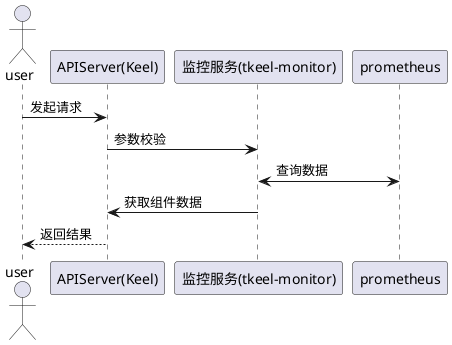
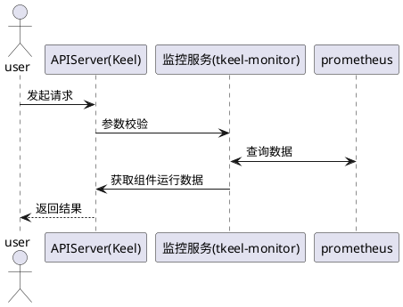

### 1.2.3 服务监控

#### 1.2.3.1 查看组件列表
##### 1.2.3.1.1 时序图

```plantuml
@startuml
actor user
participant "APIServer(Keel)"  as keel
participant “监控服务(tkeel-monitor)” as tkeelMmonitor
participant prometheus

user->keel: 发起请求
keel->tkeelMmonitor: 参数校验
tkeelMmonitor<->prometheus: 查询数据
tkeelMmonitor->keel: 获取组件数据
keel-->user: 返回结果
@enduml

```
#### 1.2.3.2 查看组件运行情况
##### 1.2.3.2.1 时序图

```plantuml
@startuml

actor user
participant "APIServer(Keel)"  as keel
participant “监控服务(tkeel-monitor)” as tkeelMmonitor
participant prometheus

user->keel: 发起请求
keel->tkeelMmonitor: 参数校验
tkeelMmonitor<->prometheus: 查询数据
tkeelMmonitor->keel: 获取组件运行数据 
keel-->user: 返回结果 
@enduml

```