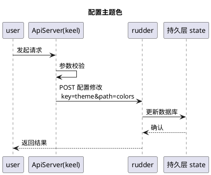
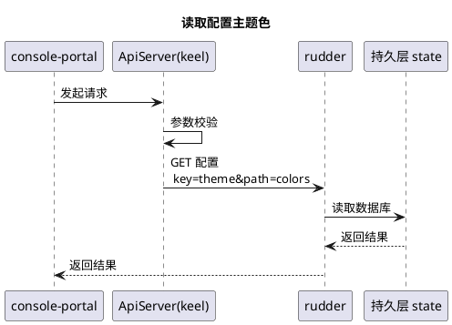
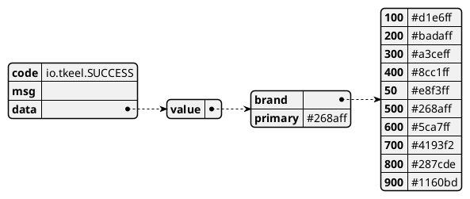
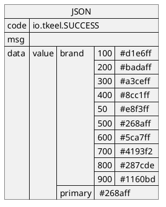
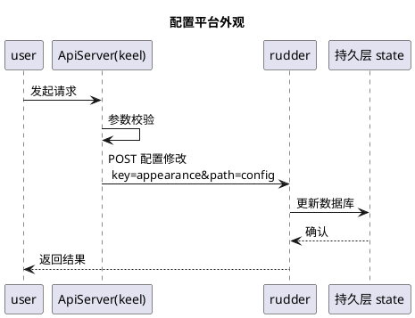
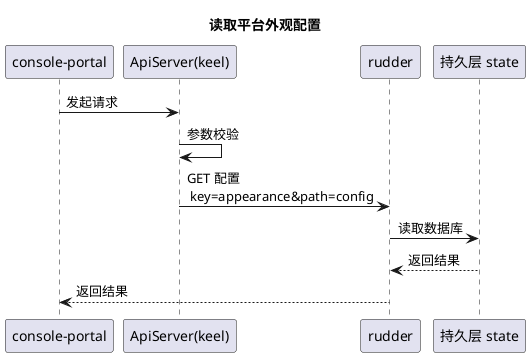
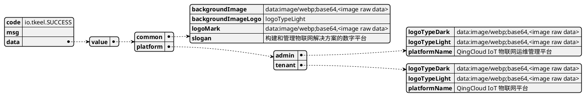
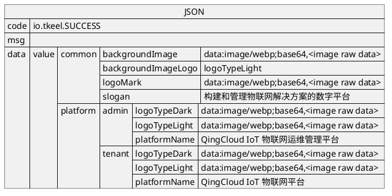

### 1.1.1 平台配置

#### 1.1.1.1 配置主题色

```plantuml
@startuml
title 配置主题色
participant "user" as user
participant "ApiServer(keel)" as keel
participant "rudder" as rudder
participant "持久层 state" as dblayer

user -> keel : 发起请求
keel -> keel : 参数校验 
keel -> rudder : POST 配置修改\n key=theme&path=colors
rudder -> dblayer : 更新数据库
dblayer --> rudder : 确认
rudder --> user : 返回结果

@enduml
```

#### 1.1.1.2 读取配置主题色

```plantuml
@startuml
title 读取配置主题色
participant "console-portal" as user
participant "ApiServer(keel)" as keel
participant "rudder" as rudder
participant "持久层 state" as dblayer

user -> keel : 发起请求
keel -> keel : 参数校验 
keel -> rudder : GET 配置\n key=theme&path=colors
rudder -> dblayer : 读取数据库
dblayer --> rudder : 返回结果
rudder --> user : 返回结果

@enduml
```

#### 1.1.1.3 配置主题色结构

```plantuml
@startjson
{
  "code":"io.tkeel.SUCCESS",
  "msg":"",
  "data":{
      "value":{
          "brand":{
              "100":"#d1e6ff",
              "200":"#badaff",
              "300":"#a3ceff",
              "400":"#8cc1ff",
              "50":"#e8f3ff",
              "500":"#268aff",
              "600":"#5ca7ff",
              "700":"#4193f2",
              "800":"#287cde",
              "900":"#1160bd"
          },
          "primary":"#268aff"
      }
  }
}

@endjson
```

```plantuml
@startuml
json JSON{
  "code":"io.tkeel.SUCCESS",
  "msg":"",
  "data":{
      "value":{
          "brand":{
              "100":" #d1e6ff",
              "200":" #badaff",
              "300":" #a3ceff",
              "400":" #8cc1ff",
              "50":" #e8f3ff",
              "500":" #268aff",
              "600":" #5ca7ff",
              "700":" #4193f2",
              "800":" #287cde",
              "900":" #1160bd"
          },
          "primary":" #268aff"
      }
  }
}
@enduml
```

#### 1.1.1.2 配置平台外观

#### 1.1.1.1 配置平台外观

```plantuml
@startuml
title 配置平台外观
participant "user" as user
participant "ApiServer(keel)" as keel
participant "rudder" as rudder
participant "持久层 state" as dblayer

user -> keel : 发起请求
keel -> keel : 参数校验 
keel -> rudder : POST 配置修改\n key=appearance&path=config
rudder -> dblayer : 更新数据库
dblayer --> rudder : 确认
rudder --> user : 返回结果

@enduml
```

#### 1.1.1.2 读取平台外观配置

```plantuml
@startuml
title 读取平台外观配置
participant "console-portal" as user
participant "ApiServer(keel)" as keel
participant "rudder" as rudder
participant "持久层 state" as dblayer

user -> keel : 发起请求
keel -> keel : 参数校验 
keel -> rudder : GET 配置\n key=appearance&path=config
rudder -> dblayer : 读取数据库
dblayer --> rudder : 返回结果
rudder --> user : 返回结果

@enduml
```

#### 1.1.1.3 平台外观配置结构

```plantuml
@startjson
{
  "code" : "io.tkeel.SUCCESS",
  "msg" : "",
  "data" : {
    "value" : {
      "common" : {
        "backgroundImage" : "data:image/webp;base64,<image raw data>",
        "backgroundImageLogo" : "logoTypeLight",
        "logoMark" : "data:image/webp;base64,<image raw data>",
        "slogan" : "构建和管理物联网解决方案的数字平台"
      },
      "platform" : {
        "admin" : {
          "logoTypeDark" : "data:image/webp;base64,<image raw data>",
          "logoTypeLight" : "data:image/webp;base64,<image raw data>",
          "platformName" : "QingCloud IoT 物联网运维管理平台"
        },
        "tenant" : {
          "logoTypeDark" : "data:image/webp;base64,<image raw data>",
          "logoTypeLight" : "data:image/webp;base64,<image raw data>",
          "platformName" : "QingCloud IoT 物联网平台"
        }
      }
    }
  }
}
@endjson
```

```plantuml
@startuml
json JSON{
  "code" : "io.tkeel.SUCCESS",
  "msg" : "",
  "data" : {
    "value" : {
      "common" : {
        "backgroundImage" : "data:image/webp;base64,<image raw data>",
        "backgroundImageLogo" : "logoTypeLight",
        "logoMark" : "data:image/webp;base64,<image raw data>",
        "slogan" : "构建和管理物联网解决方案的数字平台"
      },
      "platform" : {
        "admin" : {
          "logoTypeDark" : "data:image/webp;base64,<image raw data>",
          "logoTypeLight" : "data:image/webp;base64,<image raw data>",
          "platformName" : "QingCloud IoT 物联网运维管理平台"
        },
        "tenant" : {
          "logoTypeDark" : "data:image/webp;base64,<image raw data>",
          "logoTypeLight" : "data:image/webp;base64,<image raw data>",
          "platformName" : "QingCloud IoT 物联网平台"
        }
      }
    }
  }
}
@enduml
```
