1、创建设备模板对象

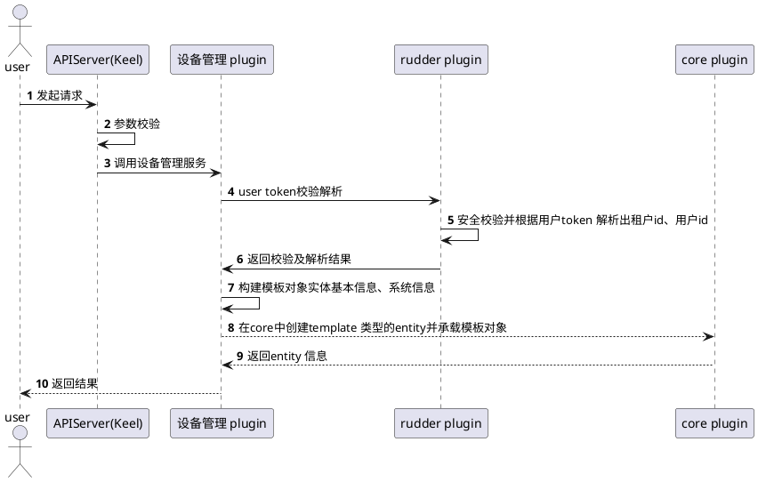
```plantuml
@startuml
actor "user" as user
participant "APIServer(Keel)"  as keel
participant "设备管理 plugin"  as dev
participant "rudder plugin"  as rdr
participant "core plugin"  as core
autonumber
user->keel:发起请求
keel->keel:参数校验
keel->dev:调用设备管理服务
dev->rdr:user token校验解析
rdr->rdr:安全校验并根据用户token 解析出租户id、用户id
rdr ->dev:返回校验及解析结果
dev->dev:构建模板对象实体基本信息、系统信息
dev-->core:在core中创建template 类型的entity并承载模板对象
core-->dev:返回entity 信息
dev-->user:返回结果
@enduml
```

1.1、模板对象图

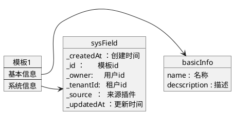
```plantuml
@startuml
object basicInfo {
   name :  名称
   decscription : 描述
}
object sysField {
   _createdAt ：创建时间
   _id ：       模板id
   _owner:      用户id
   _tenantId:   租户id
   _source  ：  来源插件
   _updatedAt ：更新时间
}

map 模板1 {
 基本信息 *-> basicInfo
 系统信息 *-> sysField
}

@enduml
```

2、编辑设备模板
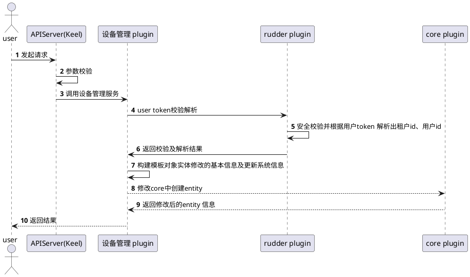
```plantuml
@startuml
actor "user" as user
participant "APIServer(Keel)"  as keel
participant "设备管理 plugin"  as dev
participant "rudder plugin"  as rdr
participant "core plugin"  as core
autonumber
user->keel:发起请求
keel->keel:参数校验
keel->dev:调用设备管理服务
dev->rdr:user token校验解析
rdr->rdr:安全校验并根据用户token 解析出租户id、用户id
rdr ->dev:返回校验及解析结果
dev->dev:构建模板对象实体修改的基本信息及更新系统信息
dev-->core:修改core中创建entity
core-->dev:返回修改后的entity 信息
dev-->user:返回结果
@enduml
```

3、查看设备模板列表
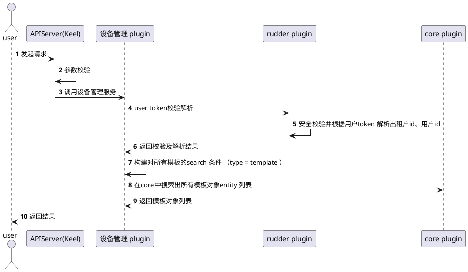
```plantuml
@startuml
actor "user" as user
participant "APIServer(Keel)"  as keel
participant "设备管理 plugin"  as dev
participant "rudder plugin"  as rdr
participant "core plugin"  as core
autonumber
user->keel:发起请求
keel->keel:参数校验
keel->dev:调用设备管理服务
dev->rdr:user token校验解析
rdr->rdr:安全校验并根据用户token 解析出租户id、用户id
rdr ->dev:返回校验及解析结果
dev->dev:构建对所有模板的search 条件 （type = template ） 
dev-->core:在core中搜索出所有模板对象entity 列表
core-->dev:返回模板对象列表
dev-->user:返回结果
@enduml
```

4、删除设备模板
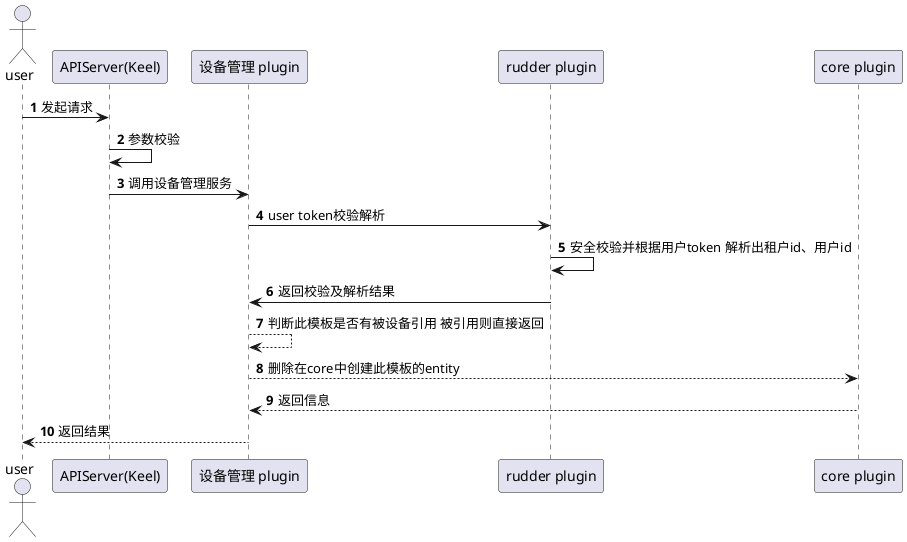
```plantuml
@startuml
actor "user" as user
participant "APIServer(Keel)"  as keel
participant "设备管理 plugin"  as dev
participant "rudder plugin"  as rdr
participant "core plugin"  as core
autonumber
user->keel:发起请求
keel->keel:参数校验
keel->dev:调用设备管理服务
dev->rdr:user token校验解析
rdr->rdr:安全校验并根据用户token 解析出租户id、用户id
rdr ->dev:返回校验及解析结果
dev-->dev:判断此模板是否有被设备引用 被引用则直接返回
dev-->core:删除在core中创建此模板的entity
core-->dev:返回信息
dev-->user:返回结果
@enduml
```

5、创建模板属性、遥测、命令定义
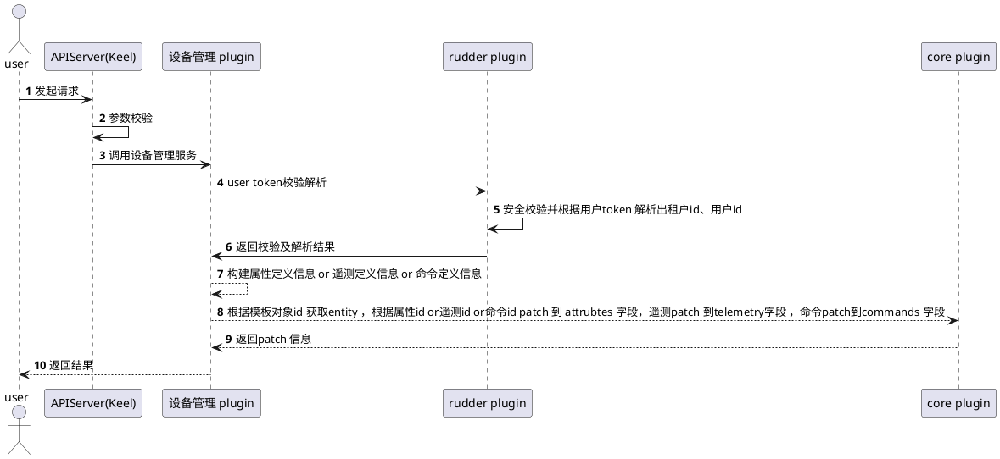
```plantuml
@startuml
actor "user" as user
participant "APIServer(Keel)"  as keel
participant "设备管理 plugin"  as dev
participant "rudder plugin"  as rdr
participant "core plugin"  as core
autonumber
user->keel:发起请求
keel->keel:参数校验
keel->dev:调用设备管理服务
dev->rdr:user token校验解析
rdr->rdr:安全校验并根据用户token 解析出租户id、用户id
rdr ->dev:返回校验及解析结果
dev-->dev:构建属性定义信息 or 遥测定义信息 or 命令定义信息
dev-->core: 根据模板对象id 获取entity ，根据属性id or遥测id or命令id patch 到 attrubtes 字段，遥测patch 到telemetry字段 ，命令patch到commands 字段 
core-->dev:返回patch 信息
dev-->user:返回结果
@enduml
```
5.1  模板含有属性or 遥测or命令 的对象图

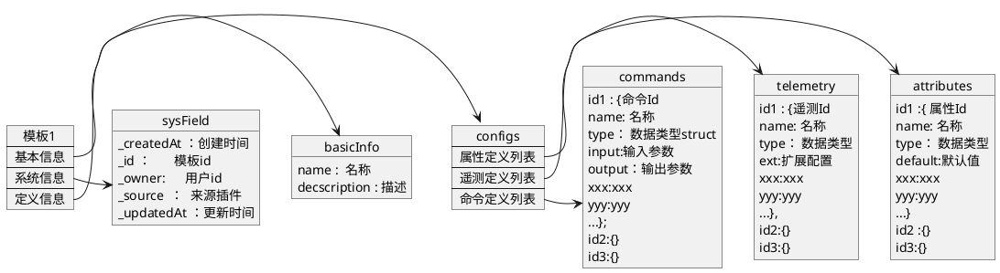
```plantuml
@startuml
object basicInfo {
   name :  名称
   decscription : 描述
}
object sysField {
   _createdAt ：创建时间
   _id ：       模板id
   _owner:      用户id
   _source  ：  来源插件
   _updatedAt ：更新时间
}
object attributes {
   id1 :{ 属性Id
   name: 名称
   type： 数据类型
   default:默认值
   xxx:xxx
   yyy:yyy
   ...}
   id2 :{}
   id3:{}
}
object telemetry {
   id1 : {遥测Id
   name: 名称
   type： 数据类型
   ext:扩展配置
   xxx:xxx
   yyy:yyy
   ...},
   id2:{}
   id3:{}
}
object commands {
   id1 : {命令Id
   name: 名称
   type： 数据类型struct
   input:输入参数
   output：输出参数
   xxx:xxx
   yyy:yyy
   ...};
   id2:{}
   id3:{}
}

map configs {
   属性定义列表 *->attributes
   遥测定义列表 *->telemetry
   命令定义列表 *->commands
}

map 模板1 {
 基本信息 *-> basicInfo
 系统信息 *-> sysField
 定义信息 *-> configs
}

@enduml
```

6、 编辑模板属性、遥测、命令定义
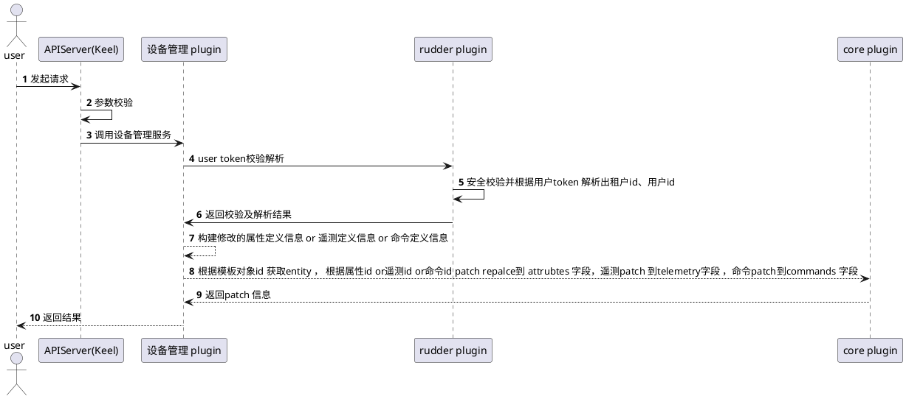
```plantuml
@startuml
actor "user" as user
participant "APIServer(Keel)"  as keel
participant "设备管理 plugin"  as dev
participant "rudder plugin"  as rdr
participant "core plugin"  as core
autonumber
user->keel:发起请求
keel->keel:参数校验
keel->dev:调用设备管理服务
dev->rdr:user token校验解析
rdr->rdr:安全校验并根据用户token 解析出租户id、用户id
rdr ->dev:返回校验及解析结果
dev-->dev:构建修改的属性定义信息 or 遥测定义信息 or 命令定义信息
dev-->core: 根据模板对象id 获取entity ， 根据属性id or遥测id or命令id patch repalce到 attrubtes 字段，遥测patch 到telemetry字段 ，命令patch到commands 字段 
core-->dev:返回patch 信息
dev-->user:返回结果
@enduml
```

7、删除模板属性、遥测、命令定义

```plantuml
@startuml
actor "user" as user
participant "APIServer(Keel)"  as keel
participant "设备管理 plugin"  as dev
participant "rudder plugin"  as rdr
participant "core plugin"  as core
autonumber
user->keel:发起请求
keel->keel:参数校验
keel->dev:调用设备管理服务
dev->rdr:user token校验解析
rdr->rdr:安全校验并根据用户token 解析出租户id、用户id
rdr ->dev:返回校验及解析结果
dev-->dev:构建修改的属性定义信息 or 遥测定义信息 or 命令定义信息
dev-->core: 根据模板对象id 获取entity ，根据属性id or遥测id or命令id patch remove到 attrubtes 字段，遥测patch 到telemetry字段 ，命令patch到commands 字段 
core-->dev:返回patch 信息
dev-->user:返回结果
@enduml
```
8、获取模板属性、遥测、命令定义列表
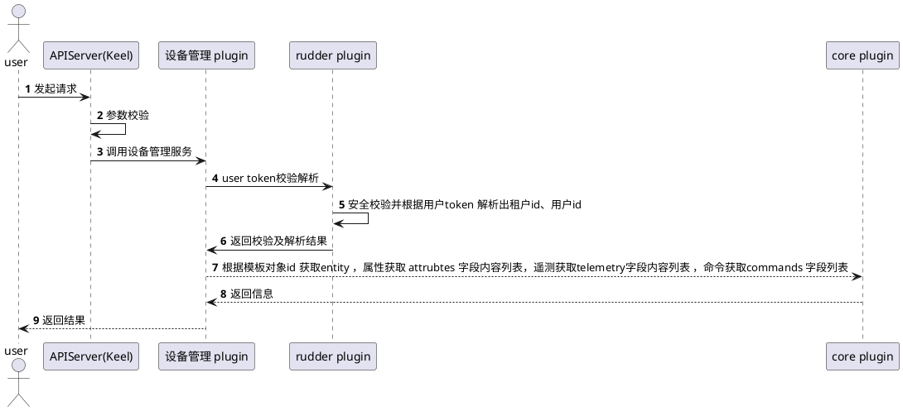
```plantuml
@startuml
actor "user" as user
participant "APIServer(Keel)"  as keel
participant "设备管理 plugin"  as dev
participant "rudder plugin"  as rdr
participant "core plugin"  as core
autonumber
user->keel:发起请求
keel->keel:参数校验
keel->dev:调用设备管理服务
dev->rdr:user token校验解析
rdr->rdr:安全校验并根据用户token 解析出租户id、用户id
rdr ->dev:返回校验及解析结果
dev-->core: 根据模板对象id 获取entity ，属性获取 attrubtes 字段内容列表，遥测获取telemetry字段内容列表 ，命令获取commands 字段列表 
core-->dev:返回信息
dev-->user:返回结果
@enduml
```

9、查看设备模版整体详情
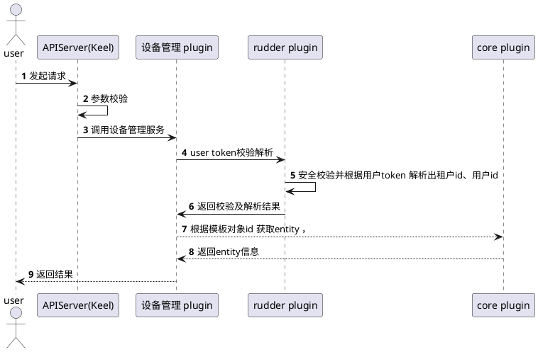
```plantuml
@startuml
actor "user" as user
participant "APIServer(Keel)"  as keel
participant "设备管理 plugin"  as dev
participant "rudder plugin"  as rdr
participant "core plugin"  as core
autonumber
user->keel:发起请求
keel->keel:参数校验
keel->dev:调用设备管理服务
dev->rdr:user token校验解析
rdr->rdr:安全校验并根据用户token 解析出租户id、用户id
rdr ->dev:返回校验及解析结果
dev-->core: 根据模板对象id 获取entity ，
core-->dev:返回entity信息
dev-->user:返回结果
@enduml
```
模板整体对象图
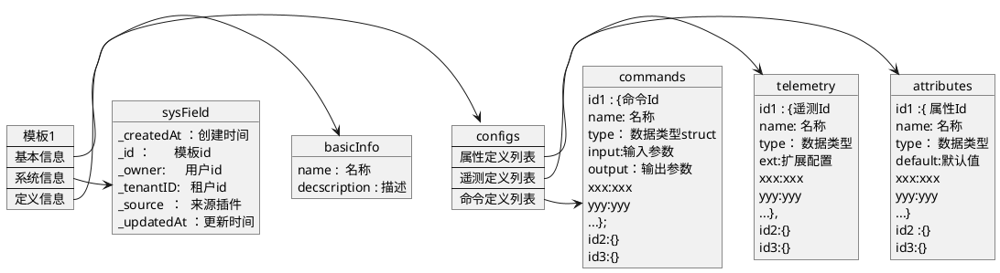
```plantuml
@startuml
object basicInfo {
   name :  名称
   decscription : 描述
}
object sysField {
   _createdAt ：创建时间
   _id ：       模板id
   _owner:      用户id
   _tenantID:   租户id
   _source  ：  来源插件
   _updatedAt ：更新时间
}
object attributes {
   id1 :{ 属性Id
   name: 名称
   type： 数据类型
   default:默认值
   xxx:xxx
   yyy:yyy
   ...}
   id2 :{}
   id3:{}
}
object telemetry {
   id1 : {遥测Id
   name: 名称
   type： 数据类型
   ext:扩展配置
   xxx:xxx
   yyy:yyy
   ...},
   id2:{}
   id3:{}
}
object commands {
   id1 : {命令Id
   name: 名称
   type： 数据类型struct
   input:输入参数
   output：输出参数
   xxx:xxx
   yyy:yyy
   ...};
   id2:{}
   id3:{}
}

map configs {
   属性定义列表 *->attributes
   遥测定义列表 *->telemetry
   命令定义列表 *->commands
}

map 模板1 {
 基本信息 *-> basicInfo
 系统信息 *-> sysField
 定义信息 *-> configs
}

@enduml
```