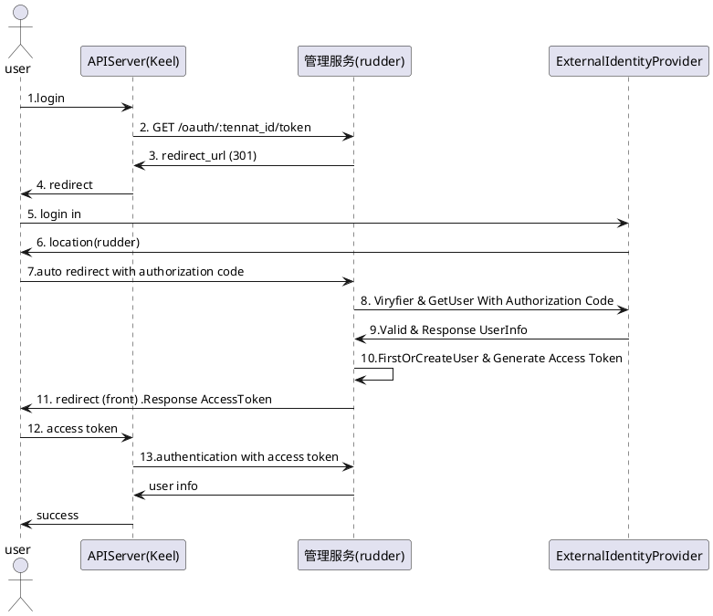

### 1.2.2 租户管理

#### 1.2.2.1 创建租户空间
##### 1.2.2.1.1 时序图
```plantuml
actor 用户 as user
participant "APIServer(Keel)"  as keel
participant "管理服务(rudder)"  as tenantService
database "Mysql" as rbacOp

user->keel:tenantId,Title,Remark
keel->tenantService:tenantId,Title,Remark
tenantService->rbacOp:create tenant model
tenantService->rbacOp:create tenant role model
tenantService->rbacOp:add policy: role permission in tenant
tenantService->rbacOp:add admin user
tenantService->rbacOp:add policy: admin user has role in tenant
tenantService->rbacOp:add group: admin user has user-sys-role in sys-tenant
tenantService->rbacOp:add policy: user-sys-role has permissin in sys-tenant
tenantService->keel:respnse
keel->user:respnse
```
#### 1.2.2.2 编辑租户空间
##### 1.2.2.2.1 时序图
```plantuml
actor 用户 as user
participant "APIServer(Keel)"  as keel
participant "管理服务(rudder)"  as tenantService
database "Mysql" as rbacOp
participant rbacOp

user->keel:tenantId,Titile,Remark
keel->tenantService:tenantId,Titile,Remark
tenantService->rbacOp:update tenant model
tenantService->keel:update tenant model
keel-->user:response
```
#### 1.2.2.3 删除租户空间
##### 1.2.2.3.1 时序图
```plantuml
actor user
participant "APIServer(Keel)"  as keel
participant "管理服务(rudder)"  as tenantService
database "Mysql" as rbacOp

user->keel:tenantId
user->tenantService:tenantId
tenantService->rbacOp:remove tenant-role policy
tenantService->rbacOp:remove tenant-user-role group-policy
tenantService->rbacOp:delete tenant's role mode
tenantService->rbacOp:delete tenant model
tenantService->rbacOp:delete tenant's user model
tenantService->rbacOp:delete tenant's plugin-role policy
tenantService->keel:response
keel->user:response
```
#### 1.2.2.4 查看用户列表
##### 1.2.2.4.1 时序图
```plantuml

header ListUser
actor user
participant "APIServer(Keel)"  as keel
participant "管理服务(rudder)"  as tenantService
database "Mysql" as DB
user->keel:request
keel->tenantService:request
tenantService->DB:call: List User
DB->tenantService: response user list
tenantService->keel:response
keel->user:response

```
#### 1.2.2.5 重置用户密码
##### 1.2.2.5.1 时序图

```plantuml

header ResetUserPassword

actor user
participant "APIServer(Keel)"  as keel
participant "管理服务(rudder)"  as tenantService
database "Mysql" as DB

user->keel:request
keel->tenantService:request
tenantService->DB:call: update User
DB->tenantService: response update user
tenantService->keel:response
keel->user:response

```
#### 1.2.2.6 单点登录
##### 1.2.2.6.1 时序图
