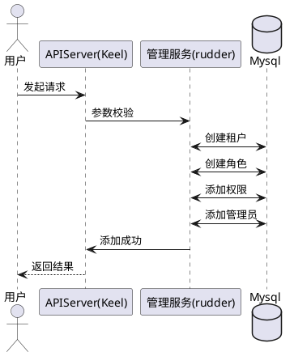
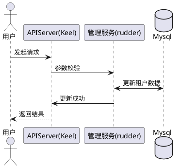
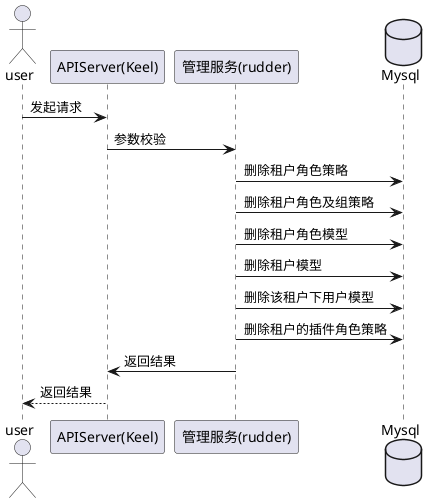
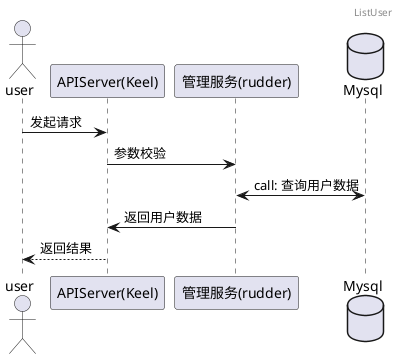
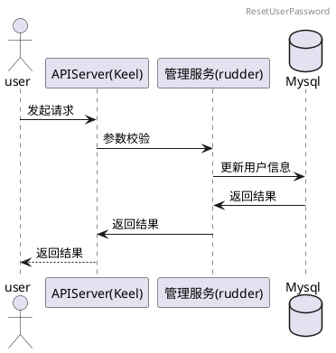
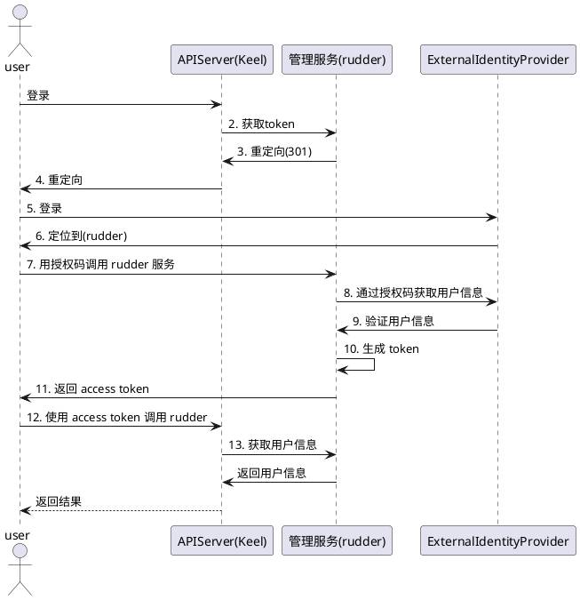

### 1.2.2 租户管理

#### 1.2.2.1 创建租户空间
##### 1.2.2.1.1 时序图

#### 1.2.2.2 编辑租户空间
##### 1.2.2.2.1 时序图

#### 1.2.2.3 删除租户空间
##### 1.2.2.3.1 时序图

#### 1.2.2.4 查看用户列表
##### 1.2.2.4.1 时序图

#### 1.2.2.5 重置用户密码
##### 1.2.2.5.1 时序图

#### 1.2.2.6 单点登录
##### 1.2.2.6.1 时序图
