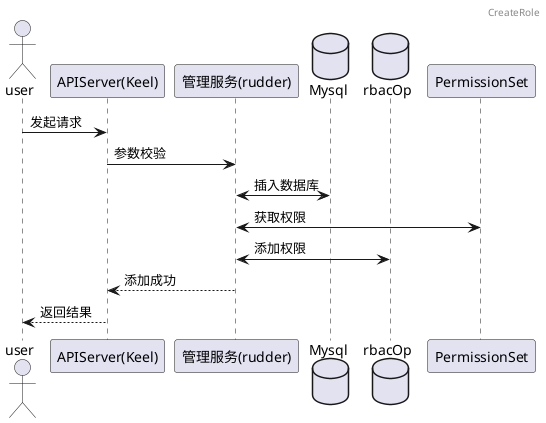
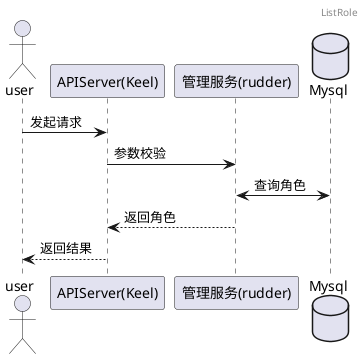
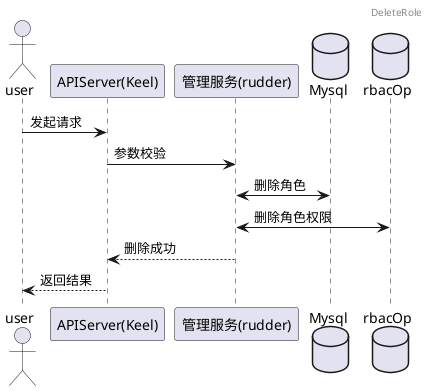
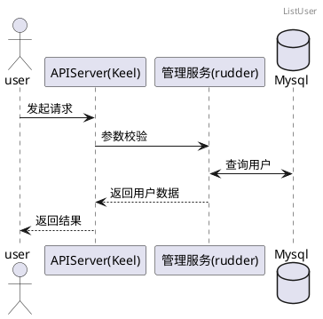
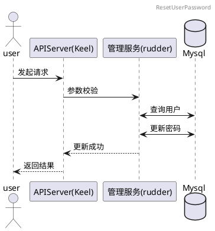
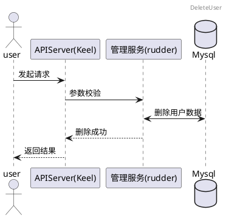
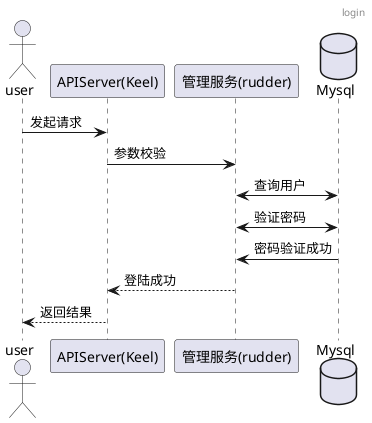

### 1.3.9 用户管理

#### 1.3.9.1 创建角色
##### 1.3.9.1.1 时序图

#### 1.3.9.2 查看角色列表
##### 1.3.9.2.1 时序图

#### 1.3.9.3 编辑角色
##### 1.3.9.3.1 时序图

#### 1.3.9.4 删除角色
##### 1.3.9.4.1 时序图

#### 1.3.9.5 创建用户
##### 1.3.9.5.1 时序图

#### 1.3.9.6 编辑用户信息
##### 1.3.9.6.1 时序图

#### 1.3.9.7 查看用户列表
##### 1.3.9.7.1 时序图

#### 1.3.9.8 重置用户密码
##### 1.3.9.8.1 时序图

#### 1.3.9.9 删除用户
##### 1.3.9.9.1 时序图

#### 1.3.9.10 登录平台
##### 1.3.9.10.1 时序图
