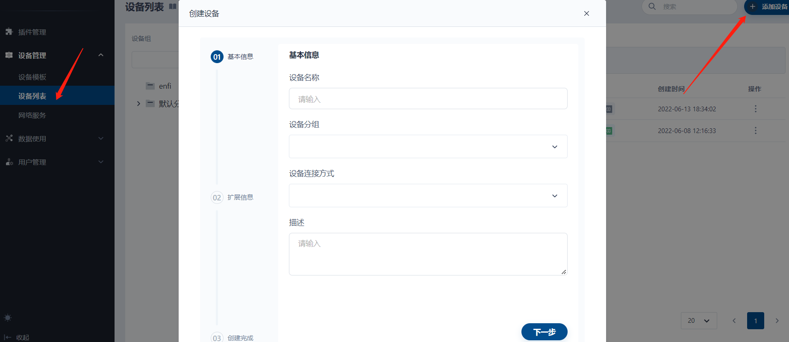
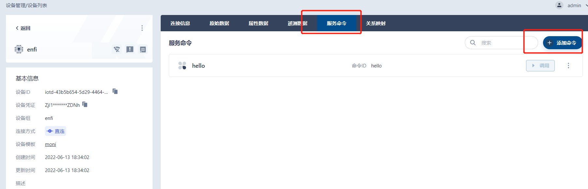
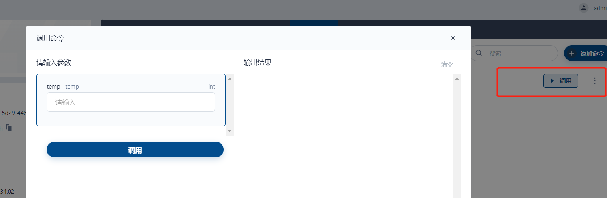
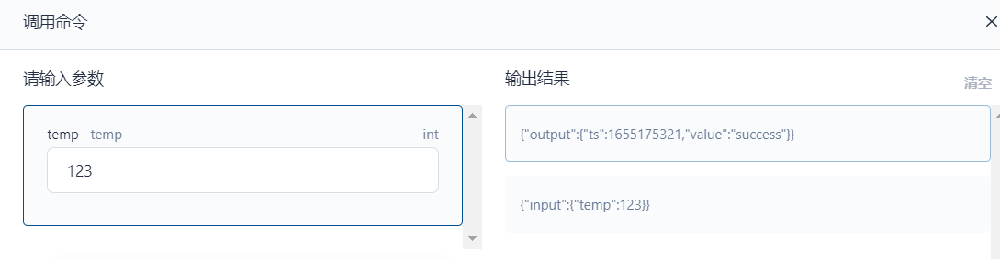

本文为您介绍如何使用 GO 语言 [SDK](https://github.com/tkeel-io/device-sdk-go) 接入设备

## 适用场景

- 单个设备的接入
- 带有子设备的设备（如数采网关）的接入

## 前提条件

### Go 环境

- [golang](https://go.dev/dl/) version: 1.16+

### 平台环境
- 已正确安装 tkeel 平台
- 启用了 IoTHub 插件

## 导入示例代码

```go
"github.com/tkeel-io/device-sdk-go/client"
```

## 建立连接

```go
// 创建默认的 client，这里将 IoTAddr 替换为安装的 iothub 的接入地址
_brokerAddr := "IoTAddr"
cli := client.NewClient(_brokerAddr, _username, _pwd)()
// 连接到 IoT Hub
cli.Connect()

// 订阅原始信息
cli.SubscribeRaw(context.TODO(), rawTopicHandler)

// 推送遥测数据
v := `{"temperature": 26.0}`
cli.PublishTelemetry(ctx, v)

// 关闭 client
cli.Close()
```

```go
// 创建支持ssl 的 client， 这里将 IoTAddr 替换为安装的 iothub 的接入地址
_brokerAddr := "IoTAddr"
cli := client.NewClient(_brokerAddr, _username, _pwd)(client.WithUseSSL(true))
```

## 如何使用SDK上报数据

```go
// 创建默认的 client ， 这里将 IoTAddr 替换为安装的 iothub 的接入地址
_brokerAddr := "IoTAddr"
cli := client.NewClient(_brokerAddr, _username, _pwd)()
// 推送遥测数据
v := `{"temperature": 26.0}`
cli.PublishTelemetry(ctx, v)
```

## 如何反控设备

平台发送给设备的数据分为三种类型：

- 原始数据
- 属性数据
- 命令

设备如果需要接收来自平台的命令或者属性的变化需要订阅对应的 topic

### 原始数据

#### 订阅原始数据 topic

```go
// 创建 client ，这里将 IoTAddr 替换为安装的 iothub 的接入地址
_brokerAddr := "IoTAddr"
cli := client.NewClient(_brokerAddr, _username, _pwd)()
// 连接到 IoT Hub
cli.Connect()
// 订阅平台下发的命令
_ = cli.SubscribeRaw(context.TODO(), rawTopicHandler)
```

#### 原始数据处理

```go
// 收到原始数据后对应的处理函数
func rawTopicHandler(message client.Message) (interface{}, error) {
    fmt.Printf("rawTopic=%s\n", string(message.Payload()))
    return nil, nil
}
```

#### Payload 样例

```text
 "12"
```

12 为平台下发的原始数据

### 属性数据

#### 订阅属性数据 topic

```go
// 创建 client ，这里将 IoTAddr 替换为安装的 iothub 的接入地址
_brokerAddr := "IoTAddr"
cli := client.NewClient(_brokerAddr, _username, _pwd)()
// 连接到 IoT Hub
cli.Connect()
// 订阅属性，平台会将变更的属性（值的变化）推送到相应的 topic
_ = cli.SubscribeAttribute(context.TODO(), attributesTopicHandler)
```

#### 属性数据处理

```go
// 收到属性数据后对应的处理函数
func attributesTopicHandler(message client.Message) (interface{}, error) {
    fmt.Printf("attributes=%s\n", string(message.Payload()))
    return nil, nil
}
```

#### Payload 样例

```json
{
  "humidity": "12"
}
```

上述样例数据代表该设备的 humidity 发生更改且更改后的值为12

### 命令

#### 订阅命令 topic

```go
// 创建 client ，这里将 IoTAddr 替换为安装的 iothub 的接入地址
_brokerAddr := "IoTAddr"
cli := client.NewClient(_brokerAddr, _username, _pwd)()
// 连接到 IoT Hub
cli.Connect()
// 订阅平台下发的命令
_ = cli.SubscribeCommand(context.TODO(), commandsTopicHandler)
```

#### 命令处理

```go
// 收到命令后对应的处理函数
func commandsTopicHandler(message client.Message) (interface{}, error) {
    fmt.Printf("commands=%s\n", string(message.Payload()))
    return "success", nil
}
```

#### Payload 样例

```json
{
  "setTemperatureThreshold": {
    "input": {
      "temperature": 12.3
    }
  }
}
```

setTemperatureThreshold 代表命令名称 input 代表输入参数 temperature 代表了输入参数的 key，如果 
commandsTopicHandler 返回的值不为 nil 那么SDK 会将返回的值上传到平台，若为 nil 则表示不需要将结果返回给平台

## 使用 SDK 接入设备实例

- 创建设备
- 创建命令
- 设备接入（使用 Go SDK） 
- 下发命令

### 创建设备

平台创建

在平台创建设备后会获得该设备的 token 供接入使用
其中 _设备ID_ 与 SDK 中 username 对应，_设备凭证_ 对应 password，记录下这两个信息，供后续设备接入使用

[API 参考](https://docs.tkeel.io/api/Device/method_CreateDevice)

### 设备接入

使用 [SDK](https://github.com/tkeel-io/device-sdk-go) 上线设备简单实例
```go
package main

import (
    "context"
    "encoding/json"
    "fmt"
    "log"
    "math/rand"
    "time"

    "github.com/pkg/errors"

    "github.com/tkeel-io/device-sdk-go/client"
    "github.com/tkeel-io/device-sdk-go/util/wait"
)

const (
    // 
    _brokerAddr = "IoTHubAddr"
    // 设备 Id 
    _username   = "iotd-43b5b654-5d29-4464-9a87-822d3aa0957d"
    // 设备凭证
    _pwd        = "ZjI1M2IyNGMtNjNjZi0zMzM5LWFlMDMtYjBkOWVlYTQ4ZDNh"
)

func main() {
    log.SetFlags(log.Lshortfile)
    // 创建连接 IoTHub 的 client
    cli := client.NewClient(_brokerAddr, _username, _pwd)()
    // 连接 IoTHub
    err := cli.Connect()
    if err != nil {
        log.Fatalln(err)
    }
    // 订阅原始数据
    _ = cli.SubscribeRaw(context.TODO(), rawTopicHandler)
    // 订阅属性数据
    _ = cli.SubscribeAttribute(context.TODO(), attributesTopicHandler)
    // 订阅下发命令
    _ = cli.SubscribeCommand(context.TODO(), commandsTopicHandler)

    tm := time.Second * 1

    wait.EveryWithContext(context.Background(), func(ctx context.Context) {
        v, _ := deviceValue()
        // telemetry.
        _ = cli.PublishTelemetry(ctx, v)
    }, tm)

    select {}
}

// 属性数据处理
func attributesTopicHandler(message client.Message) (interface{}, error) {
    fmt.Printf("attributes=%s\n", string(message.Payload()))
    return nil, nil
}

// 命令信息处理
func commandsTopicHandler(message client.Message) (interface{}, error) {
    fmt.Printf("commands=%s\n", string(message.Payload()))
    return "success", nil
}

// 原始信息处理
func rawTopicHandler(message client.Message) (interface{}, error) {
    fmt.Printf("rawTopic=%s\n", string(message.Payload()))
    return nil, nil
}

// 模拟了设备数据的获取
func deviceValue() ([]byte, error) {
    mv := map[string]interface{}{
        "humidity":    rand.Intn(20),
        "temperature": rand.Intn(20),
    }

    bys, err := json.Marshal(mv)
    if err != nil {
        err = errors.Wrap(err, "deviceValue")
    }

    return bys, err
}
```
将 `ToTHubAddr` 替换为部署的 `IoTHub` 的地址

### 创建命令

平台创建
[API 参考](https://docs.tkeel.io/api/Device/method_AddTemplateCommand)

### 下发命令

平台创建

[API 参考](https://docs.tkeel.io/api/Device/method_SetDeviceCommand)

### 设备执行结果响应

执行结果响应


