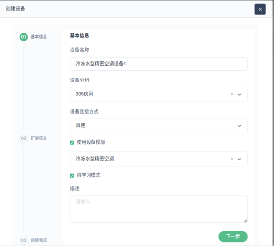

##  1、前置条件

假如B号楼2层305的机房里存在一个冷冻水型精密空调设备 ，并且我能看懂设备操作手册

## 2、 我的目地

我们的目的是：将此些设备接入到物联网平台、并可使用操作

## 3、我的直观惯性思维

基于目的，首先会出现一个惯性思维：
 1、我要定义一个楼、一个楼层、一个房间、一个设备、此类设备的模板（根据设备操作手册）
 2、我要连接和发送数据到平台
 3、我要查询、订阅、路由使用设备设备的数据

## 4、我可以分如下三步完成此目的

### 4.1、第一步：在平台上定义此设备的数字化楼、楼层、房间、设备、及其模板

#### 4.1.1 定义设备组（可选），

​		也可以叫做空间树、本质也是一个实体、理解成本角度看目前叫设备组

##### 4.1.1.1 定义楼栋

##### 4.1.1.2 定义楼层

##### 4.1.1.3 定义房间

##### 4.1.1.4 预期结果

预期结果：左侧得到一个空间树(层级结构的设备组)列表

#### 4.1.2  定义设备模板（可选）

#####  4.1.2.1 定义模板对象

预期结果：

##### 4.1.2.2 定义属性

一些关于此类设备自身的静态或半静态信息、
属性默认值表示此类设备都通用，例：设备型号、软件版本
不同设备相同定义但不同值的属性可在设备详情页修改： 如序列号

读写类型用于区分：

​            1、服务端定义属性（只写），说明：服务端API OR 界面更新、设备端不订阅不使用

​            2、设备端定义属性（只读），说明： 设备端上报更新

​            3、共享属性（读写），说明：服务段API OR 界面更新、设备端可订阅使用反控（后续）

我此时要加冷冻水型精密空调模板的如下属性，id 为自定义：
1、	设备型号、
2、	送风模式、
3、	EC送风机形式、
4、	风量、
5、	输入功率、
6、	机组最大运行功率、
7、	电加热形式、
8、	机组外形、
9、	机组重量

例：

预期结果：得到属性列表

##### 4.1.2.3 定义遥测

定义此类设备带时间序列的上报数据

我此时要添加冷冻水型精密空调的如下遥测，id引用互联网数据中心规范：

1、送风湿度

2、送风湿度

3、回风温度

4、频率

5、输入电压

6、制冷负载率

7、室内风机状态

8、通信状态

例：

预期结果：得到遥测列表

##### 4.1.2.4 定义命令

to  do 

#### 4.1.3 定义设备

​    定义此冷冻水型精密空天设备的数字化载体

预期结果：得到一个冷却水型精密空调设备1的数字化设备，并获得设备ID 及token 用于连接。

##### 

### 4.2 第二步：发送冷水型精密空调数据到平台

#### 4.2.1 按照平台消息规范发送遥测数据

#### 4.2.2  现实情况：如果没有定义模板 或者 实际设施的数据与引用模板有差别

##### 4.2.2.1 假如实际设备数据多或少一个属性

#####  4.2.2.2 假如实际设备数据多或少一个遥测

##### 4.2.2.3 假如实际设备数据多或少一个命令

##### 4.2.2.4 假如实际设备没有引用模板，需要实际设备上报数据自学习成模板

##### 4.2.2.5 假如实际设备经过数据验证后才是最终模板版本，同步到模板并同步到其他所有引用此模板的设备

##### 4.2.2.6 假如实际设备经过数据验证后差异部分需要衍生出另外一种模板而不影响当下模板，另存为模板

#### 4.2.2 按照自定义topic 、自定义格式发送原始数据

### 4.3  第三步：查询、订阅、路由、反控设备数据

#### 4.3.1 原始数据

##### 4.3.1.1 查询

##### 4.3.1.4 反控

##### 4.3.1.2 订阅

##### 4.3.1.4 路由

#### 4.3.2 模板数据

##### 4.3.2.1 查询

##### 4.3.2.2 反控

##### 4.3.2.2 订阅

##### 4.3.2.4 路由

