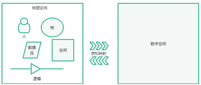
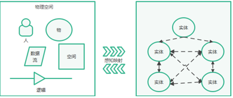
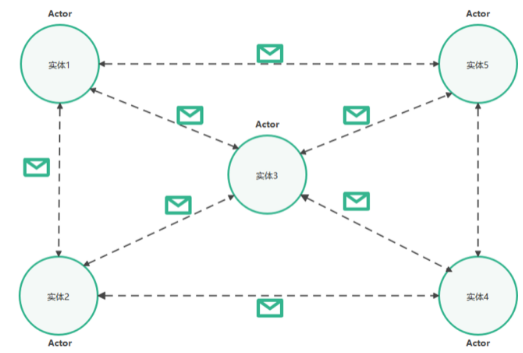
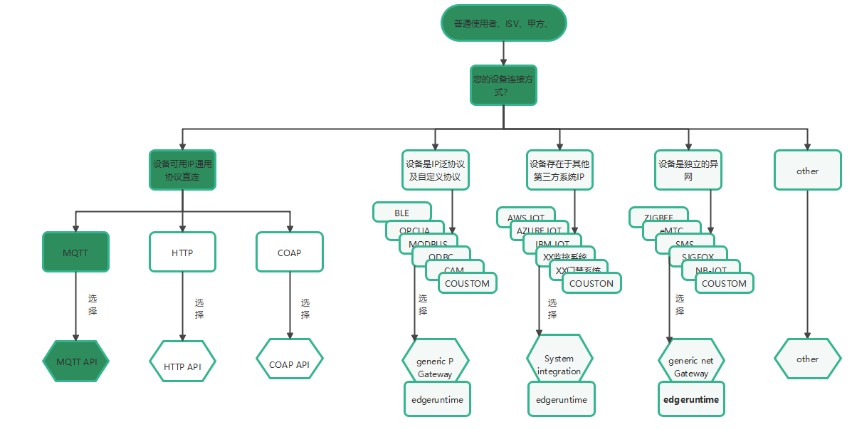
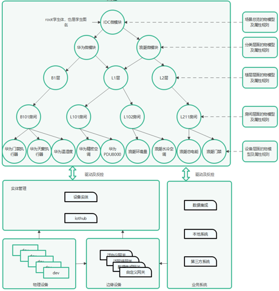
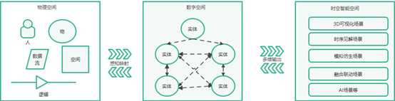

# 设备
本篇文档将会为您介绍，如何从各个层次、各个维度看待一个设备.

## 什么是数字化设备

物理 世界的“物”，在tkeel 平台通常称为“设备”或 “数字化设备”，物理世界看待物的视角信息用数字化的形式抽象表达在数字空间，即物理空间的物在数字空间的数  据表达载体即为数字化设备.

##  数字化设备为什么会存在

### 1、趋势视角：
  人存在的主要两大行为：生产、消费

 生产、消费行为生成的需求：高效率到一定阶段，会自然催生出低成本需求。高效率、低成本到一定阶段会催生出完备的用户体验需求。最终达到高效率、低成本、完备用户体验的平衡.

### 2、人、物的视角：

​     移动互联网已经实现了人人相连：人生产的数据流交互

​     物联网将扩展互联网实现物物相连、人物相连：人、物生产的数据流交互

​    为什么需要物与物、人与物的连接：
   人的生产行为—>需要进化工具->石头、铁器、蒸汽机、内燃机、发电机、计算机、互联网络等…

​    从前，一个人在单位时间内信息获取能力及控制能力非常局限-目之所及就是全部、有多少力气就移动多重的东西。

​    现在，一个人在单位时间内信息获取能力及控制能力无限扩展-只需要一个按钮就能控制N重逻辑的东西，只需一个大屏就能获取全局信息。

   人能获取信息、控制的已经不仅仅是周边的事物，边界已无限扩大，例如一个房间、一个楼层、一栋楼、一个园区、一个城市等。

   连接、计算、控制万物的媒介就是数字化设备.

### 3、时间、空间、行为的视角：
   物理空间的实体是受限与一些列物理常数设定，时间与空间都不可以自由排列组合，例如时间不可以倒流，空间不可以自由移动或组合，iot的数字空间数字化设备将打破时间和空间规定性，可构建出存在的多种可能性，例如事物的历史时间追溯原因和未来时间的模拟运行预测、自由编排获取不同空间事物信息、自由编排不同空间下的事物联动.
          

## 将物理世界的“物”抽象数字化设备

 抽象数字化设备是指是对物理世界中组成实体：人、物、空间、时间、逻辑关系的数字化表达和建模，数字化承载一切物理空间的组成实体，进而实现对物理世界实体的实时数据映射、控制、融合构建时空关系、追溯过去、提效降本现在、预测优化未来等

### 1、物理世界的组成

### 2、抽象的基础逻辑

将物理空间的任何“组成要素”在数字空间的载体一律抽象为数字化实体，
实体由四个维度的描述构成：

 属性 ： 属性是表示实体状态的数据字段

 遥测 ： 遥测字段表示度量结果或事件   

 服务 ： 可以执行的方法或能力

 关系  ： 与其他实体的定向关系组织数字化设备

### 3、示例

抽象一个物：   
1、	属性：长 、宽、高、类型、版本等静态描述信息   
2、	遥测：实时温度、速度、功率、电压、状态等动态信息   
3、	关系：与其他实体的定向关系：包含、引用等，如：此物所属于那个空间实体   
4、	能力：查询、订阅、反控   

抽象一个人：   
1、	属性：身高、体重、长相、爱好等静态特征信息   
2、	遥测：心率、血压、速度、状态等动态信息   
3、	关系：与其他实体定向关系   
4、	能力：查询、订阅、反控     

 抽象一个建筑空间：   
1、	属性：面积、地貌、地图、楼层等   
2、	遥测：能源消耗、门禁状态、电梯状态、视频监控等   
3、	关系：构成建筑的物与物层级关系、逻辑图关系   
4、	能力：查询、订阅、反控   
       

## 组织数字化设备

### 1、目地

组织的本质为构建关系，根据关系自由编排组织成某一目的的业务或服务形态

### 2、如何构建关系

  Actor模式（组织数字化设备）:   
         元素构成： 数据 +行为+消息   
         特征：面向实体 + 无锁 + 异步 + 隔离 + 分布式 + 容错

## 驱动数字化设备

驱动数字化设备是指：连接物理世界多源异构的物理设备，转换各种泛连接协议，上行数据驱动全要素实施驱动数字化设备，数字化设备下行数据转移到物理设备

### 1、选择物理设备到数字化设备的感知映射方式

### 2、 物理设备数据驱动数字化设备示例

## 使用数字化设备数据

### 1、目地

  一切行为都能解析出动机和目地，抽象、定义、组织编排、驱动数字化设备的最终目的是为了解决某一场景需求，例如：对物理设备实时数据映射、控制、融合构建时空关系、追溯过去、提效降本现在、预测优化未来等.

### 2、数字化设备输入能力

#### 基础能力

1、	以实体的维度信息按需投递   
2、	以实体为维度信息自动传播   
3、	实体搜索引擎   
4、	自由定义实体并获取非结构化数据   
5、	自由定义实体并获取结构化数据   
6、	自由编排场景并获取多维业务数据     

#### 组合能力    

1、物的感知控制   
2、全要素数字化表达    
3、可视化呈现    
4、数据融合供给    
5、空间分析计算   
6、模拟仿真推演    
7、虚实融合互动   
8、自学习自优化   
9、众创扩展   

### 3、使用方式

1、数字化设备查询搜索引擎    (链接)        

2、数字化设备数据订阅 （链接）     

3、数字化设备数据路由 （链接）  
